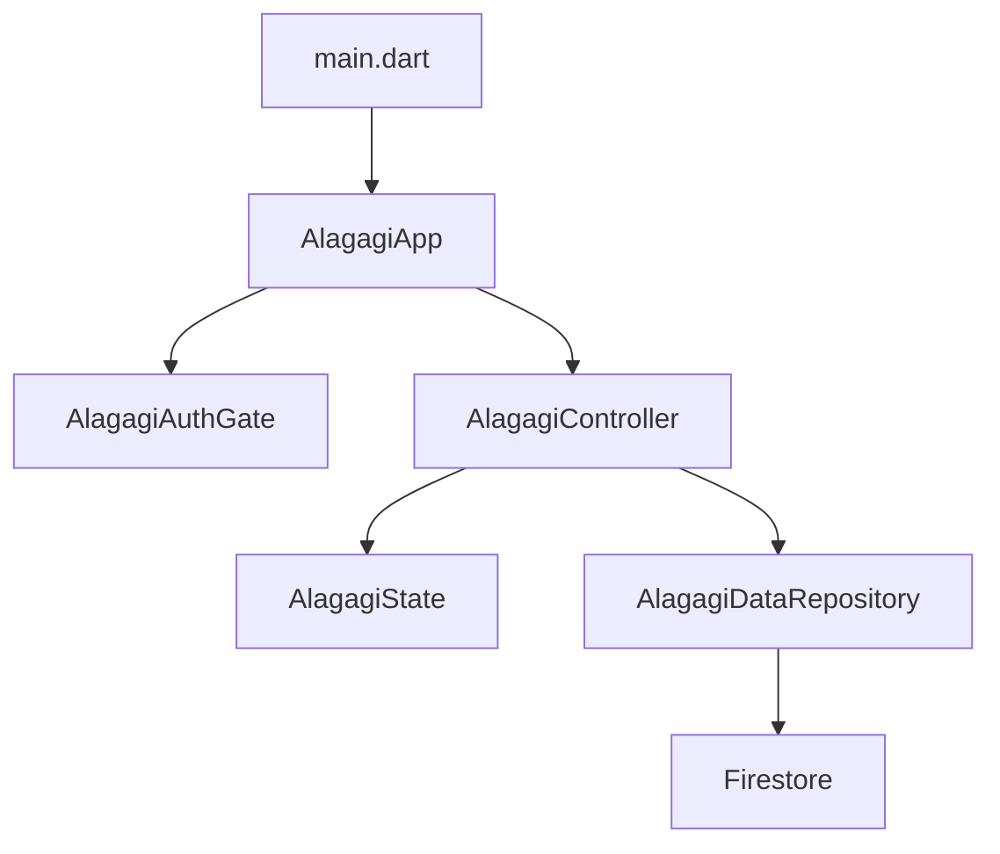

# 알아가기 SDD

> Current source of truth: [spec.md](spec.md) and the feature specs under [spec/](spec/).

이 문서는 초기 MVP 기록을 보존한다. 현재 개발 방향은 `index.html` 디자인 시안 기반의 `알아가기` 제품이며, 상세 요구사항과 화면별 인수 기준은 [spec.md](spec.md)와 기능별 spec을 따른다.

## Current SDD Operating Rules

- 모든 기능 변경은 [spec.md](spec.md) 또는 관련 기능별 spec을 먼저 수정한다.
- spec 변경 후 [test_plan.md](test_plan.md)에 실패해야 하는 테스트를 추가한다.
- 테스트가 실패하는 것을 확인한 뒤 production code를 수정한다.
- Firestore-backed 기능은 Spark/free-plan budget을 먼저 확인한다.
- 사용자 입력 중 keystroke는 Firestore write를 만들지 않는다.
- 명시적 저장/선택/수정 액션은 기본적으로 1 document write 이하로 설계한다.
- 사진/음성/영상 업로드, TTL, backup, PITR, restore, clone, Cloud Functions 의존 기능은 무료 플랜 MVP에서 제외한다.

## Current Roadmap

- v0.5: Answer Experience
  - 답변 수정
  - 긴 답변 preview 접기/펼치기
  - draft 유지
  - 저장 피드백과 실패 재시도
- v0.6: Daily Question Operations
  - 하루 질문 progress 문서
  - progress의 currentQuestionId로 오늘 질문 결정
  - progress fallback
  - static question catalog 유지
- v0.7: Answer Comments
  - 상대 답변에 직접 입력하는 짧은 댓글
  - 답변당 사용자별 댓글 1개
  - 채팅/typing/presence 없이 명시적 저장만
- v0.8: Personalization
  - 앱 이름/홈 문구 설정
  - inviteLine/accentEmoji fallback 필드 보존
- v0.9: Question Mood & Stability
  - 질문 분위기 선택
  - 다음 만남/타임캡슐 후보 검토
  - loading/error/offline UX

## 1. Product Intent

`알아가기`는 소개팅 이후 서로의 취향과 생각을 천천히 알아가는 모바일 우선 웹앱이다.
핵심 감정은 "부담 없는 궁금함"이며, 사귀는 관계를 전제하지 않는 비공개 대화 경험을 우선한다.

## 2. MVP Scope

### In

- 민영/영우 전용 로그인과 자동 로그인
- 하루 질문 진행 관리
- 내 답변 작성/수정과 긴 답변 접기
- 상대 답변에 대한 짧은 댓글
- 부담 없는 밸런스 게임
- 소개 카드 슬롯 작성
- `언젠가, 같이` 위시 추가/관심 표시/완료
- 앱 이름/홈 문구 개인화
- Firebase Spark/free-plan 안에서 동작하는 Firestore 저장

### Out

- 위치 추적
- 실시간 채팅/typing/presence
- 푸시 알림
- 사진/음성/영상 업로드
- AI 질문 생성
- 공개 회원가입과 다수 사용자 공간
- App Store/TestFlight 배포 자동화

## 3. User Stories

- 사용자는 로그인 후 오늘의 질문을 확인한다.
- 사용자는 답변을 작성한 뒤 필요하면 같은 답변을 수정한다.
- 사용자는 내 답을 남긴 뒤 상대 답을 확인한다.
- 사용자는 상대 답변에 짧은 댓글을 남긴다.
- 사용자는 밸런스 게임과 위시리스트로 가볍게 취향을 표현한다.
- 사용자는 홈 문구와 앱 이름을 부담 없는 톤으로 조정한다.

## 4. Acceptance Criteria

- 로그인 화면은 두 사람만 들어올 수 있는 비공개 공간임을 안내한다.
- 초대 화면 CTA는 `대화 공간으로 들어가기`로 표시된다.
- 홈 화면은 `오늘도 한 가지를 알아가요` 계열의 낮은 압력 문구를 사용한다.
- 질문/밸런스/위시 UI는 하트, 커플, 기념일, 애정 표현 톤을 사용하지 않는다.
- 위시리스트는 `서로 관심`, `관심 표시` 표현을 사용한다.
- 모바일 폭에서 큰 정적 이모지 장식 대신 안정적인 아이콘/텍스트 배지를 사용한다.
- `flutter test`가 통과한다.
- `flutter analyze`에서 에러가 없어야 한다.

## 5. Architecture

## 6. TDD Rules

- 새 행동은 먼저 domain 또는 widget test로 고정한다.
- UI 테스트는 사용자가 보는 한국어 문구를 기준으로 검증한다.
- 랜덤성은 테스트 가능하도록 순환형 선택으로 시작한다.
- 외부 패키지는 MVP 요구가 명확해질 때만 추가한다.

## 7. Roadmap

- v0.1: Flutter Web MVP, 메모리 상태, 테스트 포함
- v0.2: 로컬 저장
- v0.3: Firebase 로그인/Firestore 비공개 저장
- v0.4: 실제 콘텐츠와 샘플 데이터 정리
- v0.5: 답변 작성/수정 경험
- v0.6: 하루 질문 진행 관리
- v0.7: 상대 답변 댓글
- v0.8: 개인화
- v0.9: 질문 분위기와 모바일 UX 안정화
