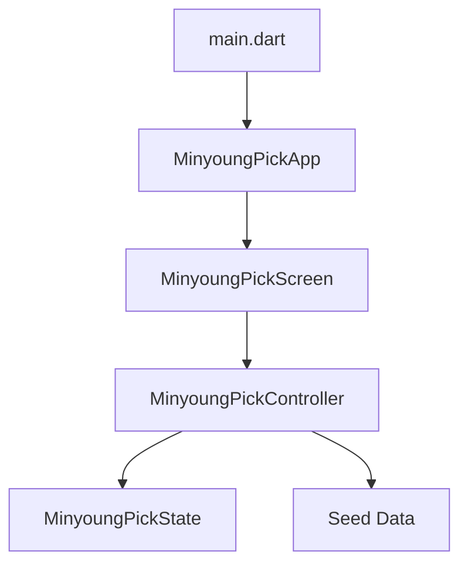

# 알아가기 SDD

> Current source of truth: [spec.md](spec.md)

이 문서는 최초 `민영 Pick` MVP 기록을 보존한다. 현재 개발 방향은 `index.html` 디자인 시안 기반의 `알아가기` 제품이며, 상세 요구사항과 화면별 인수 기준은 [spec.md](spec.md)를 따른다.

## 1. Product Intent

`민영 Pick`은 소개팅 이후 다음 만남을 가볍게 고를 수 있는 모바일 우선 웹앱이다.
핵심 감정은 "부담 없는 호감"이며, 설치나 회원가입 없이 링크로 열어볼 수 있는 경험을 우선한다.

## 2. MVP Scope

### In

- 다음 약속 후보 3개를 보여준다.
- 민영이가 하나의 후보를 선택할 수 있다.
- 랜덤 데이트 아이디어를 버튼으로 넘겨볼 수 있다.
- 취향 질문 3개에 대해 선택지를 고를 수 있다.
- 작은 쿠폰을 사용/되돌리기 상태로 토글할 수 있다.
- 모든 상태는 v0.1에서 앱 실행 중 메모리에만 유지한다.

### Out

- 로그인
- 위치 추적
- 채팅
- 푸시 알림
- 서버 저장
- App Store/TestFlight 배포 자동화

## 3. User Stories

- 민영이는 링크를 열자마자 다음 약속 후보를 확인한다.
- 민영이는 마음에 드는 후보 하나를 고른다.
- 민영이는 랜덤 아이디어를 넘겨보며 가벼운 재미를 느낀다.
- 민영이는 음식, 카페, 시간 취향을 부담 없이 선택한다.
- 민영이는 쿠폰을 보고 장난스럽게 하나를 사용 상태로 바꾼다.

## 4. Acceptance Criteria

- 앱 제목 `민영 Pick`이 첫 화면에 보인다.
- `성수 카페`, `한강 산책`, `작은 전시` 후보가 보인다.
- 후보를 누르면 해당 후보만 선택 상태가 된다.
- `다른 픽 보기`를 누르면 오늘의 아이디어가 다음 항목으로 바뀐다.
- 취향 선택지는 누르면 선택 상태가 유지된다.
- 쿠폰 버튼은 사용 전/사용 완료 상태를 토글한다.
- `flutter test`가 통과한다.
- `flutter analyze`에서 에러가 없어야 한다.

## 5. Architecture

## 6. TDD Rules

- 새 행동은 먼저 domain 또는 widget test로 고정한다.
- UI 테스트는 사용자가 보는 한국어 문구를 기준으로 검증한다.
- 랜덤성은 테스트 가능하도록 순환형 선택으로 시작한다.
- 외부 패키지는 MVP 요구가 명확해질 때만 추가한다.

## 7. Roadmap

- v0.1: Flutter Web MVP, 메모리 상태, 테스트 포함
- v0.2: 로컬 저장
- v0.3: Firebase Firestore로 선택 결과 공유
- v0.4: Android APK 및 iOS TestFlight 실험
