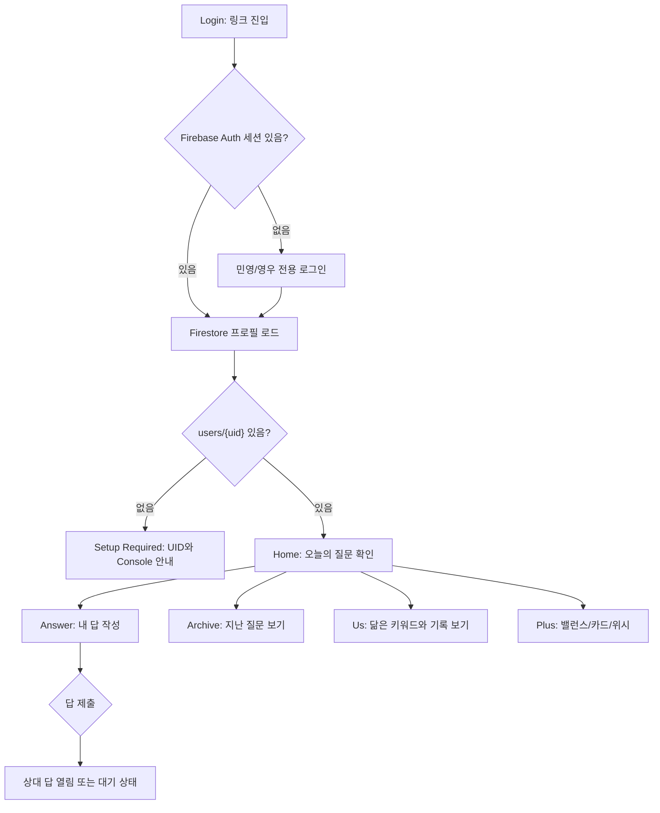
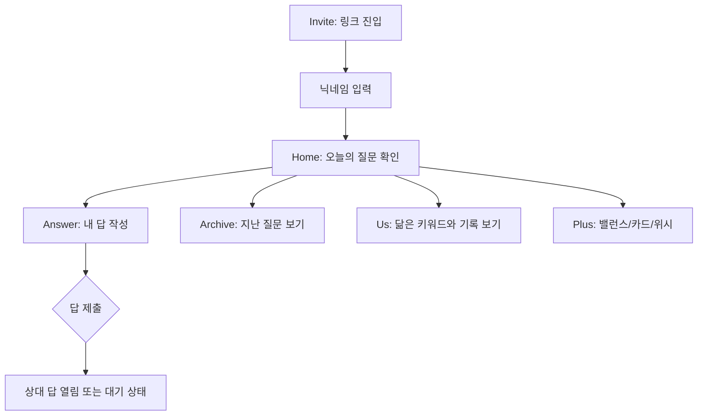

# 조금씩 Product Spec

## 0. Source

- Reference board: `/Users/admin/AndroidStudioProjects/skylife-ux3.0/webapp-design/index.html`
- Primary visual direction: `design2.html` 시안 2, Modern Minimal
- Included flow screens: `invite.html`, `design2.html`, `answer.html`, `archive.html`, `us.html`
- Included plus screens: `balance.html`, `card.html`, `wishlist.html`, `features.html`
- Alternative visual references: `design1.html`, `design3.html`

## 0.1 AI Harness / Development Contract

This repository is intentionally structured so an AI coding agent can continue the app safely without relying on hidden chat context.

Required harness files:

- `AGENTS.md`: root-level working contract for AI agents and future maintainers.
- `docs/spec.md`: product source of truth and acceptance criteria.
- `docs/test_plan.md`: test intent that mirrors new spec behavior before implementation.
- `scripts/verify.sh`: local one-command verification for dependency install, analysis, tests, and web build.
- `.github/workflows/deploy.yml`: CI gate that runs analysis, tests, and release web build before GitHub Pages deploy.
- `.github/pull_request_template.md`: review checklist that keeps SDD/TDD, Firebase budget, UX tone, and verification visible.

AI change workflow:

1. Update `docs/spec.md` before changing production behavior.
2. Update `docs/test_plan.md` and add/adjust domain or widget tests that express the behavior.
3. Confirm the test fails or clearly covers the previous gap before implementation when practical.
4. Implement the smallest production change that satisfies the spec and tests.
5. Run `dart analyze` and `flutter test`; run `flutter build web` when deployment or visible web UI is affected.
6. Keep Firebase secrets, password helper scripts, generated builds, and local-only data out of Git.

Acceptance Criteria:

- A new AI agent can open the repository and understand the required development order without reading prior chat history.
- CI fails when Dart analysis or tests fail.
- Local verification is available through a single script.
- PRs expose whether spec, test plan, tests, Firebase budget, and user-facing tone were considered.

## 1. Product Summary

`조금씩`은 소개팅 이후 두 사람이 부담 없이 서로를 알아가도록 돕는 비공개 모바일 웹앱이다.
사용자는 링크 하나로 들어오고, 민영과 영우에게만 발급된 아이디/비밀번호로 로그인해 시작한다.
앱은 매일 하나의 질문, 가벼운 밸런스 선택, 천천히 채워지는 소개 카드, 함께 해보고 싶은 위시리스트를 통해 대화가 서두르지 않고 자연스럽게 이어지도록 설계한다.

초기 Flutter MVP는 `조금씩` 컨셉으로 전체 리디자인한다.
다음 만남 후보 선택/쿠폰 중심 구조는 제거하거나 후순위로 내리고, 질문 기반의 상호 이해 경험을 핵심으로 삼는다.

## 2. Product Goals

- 링크만 열어도 바로 이해되는 비공개 대화 경험을 만든다.
- 매일 하나의 질문에 답하는 가벼운 루틴을 만든다.
- 내 답을 남기면 상대 답이 열리는 구조로 상호성을 만든다.
- 답하지 않아도 괜찮은 무압박 흐름을 제공한다.
- 쌓인 답변에서 닮은 키워드와 기록을 보여준다.
- “다음 만남”으로 이어질 수 있는 위시리스트를 자연스럽게 제공한다.

## 3. Non Goals

- 공개 소셜 네트워크
- 여러 명이 쓰는 커뮤니티
- 실시간 채팅
- 위치 추적
- 연락 빈도 분석
- 과한 커플앱/기념일앱 톤
- App Store 배포 필수 기능
- 공개 회원가입
- 비밀번호 찾기/이메일 인증 자동화
- 관리자 화면

## 4. Target Users

### Primary User

- 소개팅 이후 호감은 있지만 아직 관계가 확정되지 않은 사람
- 직접적인 고백이나 커플앱보다 가볍고 센스 있는 장치를 선호하는 사람
- 모바일 링크로 부담 없이 들어와 짧게 답할 수 있는 경험을 원하는 사람

### Relationship Stage

- 소개팅 이후 1-4주
- 서로를 더 알고 싶지만 과하게 빠른 친밀감 표현은 피해야 하는 단계
- 앱 표현은 “우리 사귀자”가 아니라 “천천히 알아가 볼래요?”에 머물러야 한다.

## 5. Tone Principles

- 부드럽다: 명령형보다 초대형 문장을 사용한다.
- 조용하다: 과도한 이모지, 알림, 축하 효과를 줄인다.
- 안전하다: 언제든 패스/그만두기 가능하다는 감각을 준다.
- 상호적이다: 한 사람이 일방적으로 관찰하는 느낌을 피한다.
- 천천히 깊어진다: 처음부터 가치관/속마음 질문으로 들어가지 않는다.
- 연애를 전제하지 않는다: 사귀는 사이처럼 보이는 하트, 사랑, 커플, 애정 표현, 기념일 톤을 피한다.
- 관심은 가볍게 표시한다: `좋아요`나 heart icon보다 `관심 표시`, `서로 관심`처럼 부담 없는 표현을 쓴다.

### Preferred Copy

- `우리, 천천히 알아가 볼래요?`
- `하루에 질문 하나, 서로의 이야기를 나누는 작고 조용한 공간이에요.`
- `정답은 없어요. 떠오르는 대로, 솔직한 한 줄이면 충분해요.`
- `내 답을 남기면 함께 열려요.`
- `오늘은 답하기 어렵나요? 내일 다시 보기`
- `답변 속 공통점이 조금씩 보여요`
- `비공개 대화 공간`
- `서로 관심`

### Avoided Copy

- `여자친구 앱`
- `커플 전용`
- `사랑 지수`
- `하트`
- `애정 표현`
- `기념일`
- `상대 추적`
- `답장 안 했어요`
- `왜 답하지 않았나요?`

## 6. Visual Direction

### Chosen Direction

Reference `design2.html`: Modern Minimal, sage, warm paper, serif title.

### Visual Keywords

- 세이지 미니멀
- 종이 같은 배경
- 낮은 대비의 따뜻함
- serif headline
- 조용한 카드형 정보
- 작은 점 형태의 bottom navigation indicator
- 텍스트 이모지 장식보다 일관된 line icon

### Color Tokens

- Background outer: `#e9e8e2`
- App background: `#f4f3ef`
- Paper: `#fcfcfa`
- Ink: `#2e2e2c`
- Muted: `#9a9890`
- Sage: `#8a9a7e`
- Sage deep: `#6f7f63`
- Lavender accent: `#b9a8c9`
- Line: `#e8e6df`
- Soft sage fill: `#dfe6d4`
- Sage panel: `#cdd6c2`

### Typography

- Display/heading reference: `Nanum Myeongjo`
- Body reference: `Noto Sans KR`
- Flutter implementation should use available fonts first.
- If external font assets are not added in MVP, use system fallback while preserving weight, spacing, and hierarchy.

### Layout

- Mobile first.
- Design target width: 390px.
- Minimum target viewport height: 840px.
- Main content should be constrained around 390-520px on desktop web.
- Cards use 18-24px radius in this specific design system, matching the reference.
- Bottom navigation is fixed at bottom with translucent paper background.
- Avoid nested cards except where the reference explicitly frames a phone preview or a repeated list item.
- 초대 노트, 홈 기능 카드, 밸런스 선택지, 소개 카드 슬롯, 위시 카드의 아이콘은 모바일에서 텍스트보다 시각 우선순위가 높아지지 않게 작고 일관된 line icon으로 표시한다.
- 실제 모바일 브라우저/PWA에서 OS 상태바가 이미 보이므로 앱 내부에는 `9:41`, 배터리, 신호 점 같은 fake status row를 렌더링하지 않는다.
- 상단 안정감은 fake status row 대신 화면별 safe top spacing과 명확한 header/top bar로 만든다.

## 7. Information Architecture

### Primary Navigation

- 홈
- 질문
- 음악
- 마이

### Expanded Navigation For Plus Features

For MVP, plus features can be reached from home sections or lightweight cards.
If the app grows, bottom navigation may become:

- 홈
- 질문함
- 카드
- 위시

`기록` can remain reachable from 홈/질문함 or be a tab depending on implementation complexity.

### MVP v0.13 Navigation Direction

- v0.13 기준 하단 탭은 `홈 / 질문 / 음악 / 마이` 4개로 유지한다.
- 기존 `기록` 하단 탭은 제거하고 `질문` 탭 안의 `달력 / 기록` segmented view로 합친다.
- 모바일 하단 탭은 콘텐츠를 과하게 가리지 않도록 compact 높이를 유지한다.
- 홈은 오늘의 질문과 가벼운 다음 행동 중심으로 유지하며, 음악 기능을 큰 홈 카드로 추가하지 않는다.
- 음악 기능은 독립 탭으로 제공해 반복 방문 가능한 작은 루틴처럼 보이게 한다.
- Selected design: `docs/design/music_tab_navigation_concept.html`.

### MVP v0.14 Readable Detail Pattern

- 긴 사용자 입력은 카드/리스트 안에서 2-4줄 preview와 말줄임으로 보여준다.
- 긴 preview에는 하단 반복 문구 대신 본문 끝의 페이드와 `펼쳐 읽기` affordance를 보여준다.
- 짧은 preview에는 별도 전체 보기 affordance를 노출하지 않아 카드/리스트의 반복감을 줄인다.
- preview 카드 또는 읽기 affordance를 누르면 전체 본문을 scroll 가능한 bottom sheet로 보여준다.
- 전체 보기 bottom sheet는 label, 제목, 본문, 닫기 action을 포함한다.
- 전체 보기 bottom sheet는 읽기 집중형 header, 작은 context icon, paper-style body card, 44px급 하단 action을 사용해 긴 글을 편하게 읽게 한다.
- 내 콘텐츠인 경우에는 전체 보기 bottom sheet 안에서 관련 수정 action을 제공할 수 있다.
- 읽기 전용 화면의 전체 보기 bottom sheet는 동작하지 않는 수정 action을 노출하지 않는다.
- 전체 보기/닫기/scroll은 Firestore read/write를 만들지 않는 local UI interaction이다.
- 적용 대상은 홈 오늘의 질문 답변/댓글, 질문함 선택/기록 답변, 마이 최근 내 흔적, 음악 노트, 소개 카드 읽기 preview다.
- 소개 카드처럼 작은 타일이 반복되는 화면은 텍스트형 전체 보기 action 대신 우상단 icon affordance를 사용한다.
- 밸런스 게임처럼 긴 자유 입력이 없는 기능은 이 패턴의 필수 적용 대상이 아니다.

### MVP v0.15 Brand Identity

- 서비스의 사용자-facing 이름은 `조금씩`으로 사용한다.
- 기존 코드 네임 `Alagagi`는 내부 class/file naming으로만 유지할 수 있지만, 앱 UI, 브라우저 탭, PWA 설치 이름에는 노출하지 않는다.
- 브랜드 kicker는 로마자 표기 대신 `천천히 알아가는 기록`처럼 한글 중심의 조용한 설명을 사용한다.
- 로고는 하트/커플/기념일 톤을 피하고, 작은 새싹/잎 표식과 세이지 색상의 한글 워드마크를 중심으로 만든다.
- `web/index.html` title, apple mobile title, description과 `web/manifest.json` name/short_name/theme/background 색상은 `조금씩` 브랜드와 일치해야 한다.
- favicon과 PWA icon은 동일한 브랜드 심볼을 사용하며, 16/192/512 및 maskable icon 크기를 유지한다.

### MVP v0.17 Home Curiosity Menu

- 홈 header는 단순 텍스트 제목 대신 작은 새싹 표식, `조금씩` 한글 워드마크, `천천히 알아가는 기록` 보조 문구로 앱 브랜드를 보여준다.
- 홈의 핵심 시선은 `Today's Question` 카드에 남겨두고, 추가 기능은 질문 카드 아래의 작은 `궁금함` 상태 카드로만 진입시킨다.
- `궁금함` 상태 카드는 받은 질문, 보낸 질문, 답장 완료 상태를 낮은 압력의 문구로 요약한다.
- `궁금함` 상태 카드를 누르면 bottom sheet가 열리고, 받은 질문 답장 입력, 내가 보낸 질문 상태, 새 질문 작성 흐름을 보여준다.
- 질문 작성과 답장 저장은 사용자가 명시적으로 `질문 보내기` 또는 `답장 저장하기`를 눌렀을 때만 `spaces/{spaceId}/curiosityCards/{cardId}`에 기록한다.
- `curiosityCards` 문서는 `id`, `fromProfileId`, `toProfileId`, `question`, `reply`, `createdLabel`, `repliedLabel`, `updatedAt` 필드를 가진다.
- 질문은 작성자 본인의 profile id를 `fromProfileId`로, 상대 profile id를 `toProfileId`로 저장한다. 답장은 받은 사람만 자신의 받은 질문 문서에 남기는 흐름으로 다룬다.
- 내가 보낸 질문 중 답장을 기다리는 문서가 하나라도 있으면 새 질문 작성 UI를 잠그고, `답장을 기다리는 질문이 있어요` 안내를 보여준다.
- `나중에 보기`는 sheet를 닫는 읽기 전용 UI interaction이며 Firestore write를 만들지 않는다.
- 390px 모바일 viewport에서 `Today's Question`, `궁금함` 상태 카드, 하단 내비게이션이 서로 겹치거나 잘리지 않아야 한다.

### MVP v0.18 Meeting Schedule and Place Board

- 하단 탭은 `홈 / 질문 / 음악 / 약속 / 장소 / 마이`로 확장한다.
- 각 탭 label은 2글자 중심으로 유지해 390px 모바일 viewport에서 텍스트가 줄바꿈되지 않게 한다.
- 일정 조율은 `약속` 화면에서 제공한다.
- 일정 조율은 실시간 캘린더 연동이 아니라 앱 안에 사용자가 직접 남긴 가능 여부를 기반으로 한다.
- 월간 캘린더는 `서로 가능`, `내 상세 일정 있음`, `상대 표시 있음`을 낮은 대비의 점/색상으로 구분한다.
- 날짜 선택, 월간 캘린더 계산, 화면 전환은 local UI state이며 Firestore write를 만들지 않는다.
- 사용자가 `일정 저장하기`를 누를 때만 schedule entry를 저장한다.
- schedule entry는 `dateKey`, `profileId`, `availability`, `timeSlots`, `timeBlocks`, `sharedMemo`, `updatedAt`을 공유 공간에 저장한다.
- `timeSlots`는 `오전/오후/저녁` 빠른 가능 시간이며, `timeBlocks`는 `startMinute`, `endMinute`, `title`을 가진 상세 공유 일정이다.
- 사용자는 한 날짜에 여러 상세 일정을 추가할 수 있으며 `14:00-16:30 병원 예약`처럼 몇 시부터 몇 시까지 무슨 일정인지 상대에게 공유할 수 있다.
- 상대에게 보여도 되는 조율 내용은 `상대에게 남길 한마디`인 `sharedMemo`와 `timeBlocks`에 따로 남긴다.
- 둘 다 `available`이고 겹치는 `timeSlots`가 있으면 meeting candidate로 강조한다.
- `maybe`가 포함된 날은 확정 후보가 아니라 조율 필요 상태로 둔다.
- 장소 보드는 `장소` 화면에서 제공한다.
- 장소 보드는 현재 위치 공유 기능이 아니며, 사용자가 저장한 장소만 둘에게 보인다.
- 장소 추가는 카카오 지도 검색 결과 선택을 기반으로 하며, 다른 지도 provider와 직접 입력 provider는 제공하지 않는다.
- 카카오 검색 결과는 `provider`, `providerPlaceId`, `name`, `address`, `latitude`, `longitude`, `category`로 정규화해 저장한다.
- 현재 위치, 이동 경로, 검색 API raw payload, 사진 blob은 Firestore에 저장하지 않는다.
- 장소 관심 표시는 toggle로 동작하며 `interestedByProfileIds`에 내 profile id를 추가하거나 제거한다.
- 같은 카카오 `providerPlaceId`를 다시 담으면 새 장소를 만들지 않고 기존 장소를 업데이트한다.
- 내가 담은 장소는 메모/카테고리/카카오 검색 결과를 수정하거나 삭제할 수 있다.
- 장소 화면은 일정 날짜 연결을 제공하지 않고, 장소 저장과 서로 관심 표시만 다룬다.
- Open API 준비/운영 가이드는 `docs/map_open_api_guide.md`를 따른다.
- Selected design: `docs/design/schedule_place_coordination_concept.html`.

### MVP v0.16 First Visit Guide

- 최초 방문 안내는 로그인/세션 로드 후 홈 화면이 준비된 상태에서 한 번만 bottom sheet overlay로 보여준다.
- 로그인, 로딩, Firebase setup required 상태에서는 최초 방문 안내를 보여주지 않는다.
- 첫 안내는 홈 전체를 설명하지 않고 `오늘 질문에 답하기`, `한 곡 남기기`, `언젠가 같이 담기` 3개 시작 행동만 보여준다.
- 첫 안내 CTA는 `30초 둘러보기`와 `바로 시작하기`를 제공한다.
- `바로 시작하기`는 안내를 닫고 같은 기기/공간/프로필 조합에서는 다시 자동 노출하지 않는다.
- `30초 둘러보기`는 안내를 닫고 기능 안내 bottom sheet를 연다. 이 동작도 자동 노출을 다시 만들지 않는다.
- 안내 확인 여부는 `localStorage` 같은 device-local storage에만 저장하며 Firestore read/write를 만들지 않는다.
- 저장 키는 `jogeumssik:onboardingSeen:{spaceId}:{profileId}` 형태를 사용한다.
- `마이 > 도움말 > 처음 안내 다시 보기`는 언제든 기능 안내를 다시 열 수 있어야 한다.
- 다시 보기 동작은 읽기 전용 UI interaction이며 Firestore read/write를 만들지 않는다.
- 390px 모바일 viewport에서 안내 sheet, 둘러보기/시작하기 CTA, 하단 내비게이션이 서로 겹치거나 잘리지 않아야 한다.
- 안내 문구는 소개팅 이후 알아가는 단계에 맞춰 담백하게 유지하고, 하트/커플/기념일/애정 표현 톤을 사용하지 않는다.
- Selected design: `docs/design/first_visit_guide_concept.html`.

## 8. MVP Scope

### MVP v0.2 In Scope

- 초대장 화면
- 닉네임 입력
- 홈 화면
- 오늘의 질문 카드
- 답변 입력/저장
- 내 답 저장 후 상대 답 공개 상태 표현
- 오늘은 패스
- 질문함 목록
- 알아간 기록 화면
- 밸런스 게임 1세트
- 소개 카드 화면
- 언젠가 같이 위시리스트 화면
- 로컬 메모리 상태 기반 화면 전환
- Flutter widget/unit tests

### MVP v0.2 Out Of Scope

- 실제 초대 링크 생성
- 실제 다중 사용자 동기화
- 푸시 알림
- 사진 업로드
- 플레이리스트 연동
- 쪽지함
- 타임캡슐 편지
- 실제 로그인/인증
- 데이터 암호화/보안 저장소

### MVP v0.3 Firebase Private In Scope

- Firebase Auth 기반 민영/영우 전용 로그인
- 아이디 입력값을 내부 Firebase 이메일로 매핑
  - `youngwoo` -> `youngwoo@gettoknow.local`
  - `minyoung` -> `minyoung@gettoknow.local`
- Firebase Auth 브라우저 persistence 기반 자동 로그인
- 로그아웃
- 로그인 후 Firestore `users/{uid}` 프로필 문서 로드
- `users/{uid}` 문서가 없으면 UID와 설정 안내를 보여주는 setup required 상태
- Firestore `spaces/{spaceId}` 멤버 공간 모델
- 답변, 패스, 소개 카드 슬롯, 위시 관심 표시의 repository 저장 경계
- Firebase dart-define 값이 없을 때 로컬 데모 모드로 빌드/테스트 가능

### MVP v0.3 Firebase Private Out Of Scope

- 앱 안에서 계정 생성
- 비밀번호 변경/초기화 UI
- 소셜 로그인
- 푸시 알림
- 사진 업로드
- 관리자용 데이터 편집 UI
- 완전한 오프라인 충돌 병합

### MVP v0.4 Real Content & Data Cleanup In Scope

- Firebase 모드에서 기존 샘플 기록 데이터 제거
- 질문/밸런스/소개 카드 슬롯/위시 템플릿을 실제 콘텐츠 카탈로그로 정리
- 사용자 생성 데이터는 Firestore를 단일 출처로 사용
- Firestore 데이터가 없을 때는 샘플을 대신 보여주지 않고 빈 상태를 보여준다.
- 오늘의 질문은 실제 질문 카탈로그에서 날짜/순번/depth 기준으로 선택한다.
- 아카이브는 실제 저장된 답변/패스만 보여준다.
- 알아간 기록은 실제 답변 수, 함께 답한 수, 겹치는 키워드 기반으로 계산한다.
- 밸런스 게임은 실제 선택 전에는 상대 선택을 노출하지 않는다.
- 소개 카드는 실제 작성한 슬롯만 채워진 상태로 보여준다.
- 위시리스트는 실제 추가/관심 표시/완료 데이터만 보여준다.

### MVP v0.4 Real Content & Data Cleanup Out Of Scope

- AI 질문 생성
- 외부 캘린더/지도/예약 연동
- 사진 답변 저장
- 푸시 알림 기반 질문 리마인더
- 관리자 CMS
- 다수 커플/다수 공간 운영

### MVP v0.5 Answer Experience In Scope

- User-triggered save reliability:
  - 저장 중
  - 저장 완료
  - 저장 실패
  - 수동 재시도
- 내 답변 수정
- 긴 답변 홈 preview 접기/펼치기
- 질문함에서는 저장된 전체 답변을 읽기 쉽게 표시
- 답변 작성/수정 화면에 기존 답변 preload
- 제출 후 짧은 저장 피드백
- 답변 수정 저장은 같은 Firestore answer 문서를 덮어쓴다.
- 답변 입력 중 route 이동 시 draft를 유지한다.
- 답변 저장은 명시적인 제출/수정 저장 버튼을 누를 때만 발생한다.
- 오늘 질문을 패스한 뒤 `다시 답하기`로 정상 답변을 새로 남길 수 있다.
- 120자를 넘는 답변은 홈/질문함 preview에서 접힌 상태로 시작한다.

### MVP v0.5 Answer Experience Out Of Scope

- 답변 수정 이력 전체 보관
- 답변별 공개 댓글 스레드
- 실시간 공동 편집
- 입력 중 자동 저장
- 300자를 크게 넘는 장문 에세이 모드
- 자동 재시도 loop
- 저장 실패를 사용자에게 숨기는 fire-and-forget UX

### MVP v0.6 Daily Question Operations In Scope

- `spaces/{spaceId}/progress/daily` 문서로 질문 진행 상태를 관리한다.
- 두 사용자 모두 같은 오늘의 질문을 본다.
- 하루 하나의 질문을 유지하되, 패스/미답변이 다음 날 진행을 막지 않는다.
- 질문 카탈로그는 무료 플랜 보호를 위해 앱 코드의 static product content로 유지한다.
- 오늘 질문은 `progress/daily.startedDateKey`와 Asia/Seoul 기준 오늘 날짜로 계산한다.
- `startedDateKey`는 두 사람 중 첫 사용자가 오늘 질문을 연 날짜로 한 번만 고정한다.
- `startedDateKey` 기준 1일차는 `q001`, 2일차는 `q002`처럼 카탈로그 순서에 매핑한다.
- 앱은 계산된 질문을 `currentQuestionId`로 저장해 두 사람이 같은 질문을 보도록 공유한다.
- Progress 문서가 없으면 오늘 날짜로 `startedDateKey`를 만들고 `q001`부터 시작한다.
- 기존 progress 문서에 `startedDateKey`가 없으면 `openedDateKey`를 시작일로 간주해 안전하게 마이그레이션한다.
- 날짜가 바뀌면 앱 첫 진입 시 progress를 새 날짜와 질문으로 최대 1회 갱신한다.
- 앱 로드, route 이동, scroll, tab switch는 progress write를 만들지 않는다.
- 같은 날짜 안의 새로고침/route 이동은 progress write를 만들지 않는다.
- 질문 카탈로그를 모두 소진하면 마지막 질문을 유지하고 future day는 empty/end state로 보여준다.
- 시작일 재설정은 MVP에서 제외하고, 필요하면 나중에 관리자/설정 기능으로 분리한다.

### MVP v0.6 Question Calendar & Late Answers In Scope

- 질문함 상단에 compact 월간 캘린더형 질문 진행 UI를 제공한다.
- 캘린더 날짜는 `startedDateKey`와 질문 카탈로그 순서로 질문을 매핑한다.
- 각 날짜는 답변 상태를 작은 표시로 보여준다:
  - 아직 아무도 답하지 않음
  - 나만 답함
  - 상대만 답함
  - 둘 다 답함
  - 내가 패스함
  - 미래 질문
  - 오늘 질문
- 과거 미답 질문은 `늦게 답하기` CTA를 제공한다.
- 과거에 이미 답한 질문은 읽기 전용으로 보여주고 MVP에서는 수정하지 않는다.
- 오늘 질문은 기존 답변 작성/패스 흐름을 그대로 사용한다.
- 미래 날짜는 질문 미리보기 제목만 제한적으로 보여주거나 disabled state로 둔다.
- 날짜를 선택해도 곧바로 답변을 저장하지 않고, detail 영역에서 사용자가 `늦게 답하기`를 누를 때만 답변 입력 화면으로 이동한다.
- 늦게 답하기 화면은 오늘 질문 답변 화면과 같은 컴포넌트를 재사용하되, 상단 보조 문구로 선택한 과거 날짜를 보여준다.
- 캘린더 월 이동, 날짜 선택, tab switch는 Firestore write를 만들지 않는다.
- 늦게 답하기 저장은 기존 answer document ID `{questionId}_{uid}`에 1 write로 저장한다.
- 캘린더 상태 계산을 위한 별도 Firestore calendar collection은 만들지 않는다.
- 질문 상태는 정적 질문 카탈로그, `progress/daily.startedDateKey`, `answers` 문서만으로 계산한다.

### MVP v0.9 Stabilization Batch

This batch fixes the highest-risk gaps found after the v0.6 calendar/design audit. It must be implemented in SDD/TDD order.

- Partner answer reveal:
  - In Firebase-backed mode, a partner answer is visible only after my non-skipped answer has been persisted successfully.
  - While my answer save is pending or failed, partner answer and comment UI remain locked.
  - Skipped answers do not unlock partner answer or comment UI.
  - Local demo mode may keep immediate optimistic reveal for preview convenience.
- Save feedback:
  - Explicit user actions that write to Firestore expose at least a visible failed state or non-destructive no-op.
  - Answer save failure preserves retry state and must not make the answer look fully synchronized.
  - Late answer save failure keeps the selected archive detail recoverable with a visible retry action.
  - Comment save failure preserves the draft/comment text and exposes a retry action instead of silently swallowing the failure.
  - Wishlist interest is additive in this MVP: tapping an already-interested wish is a no-op and creates no write.
- Calendar:
  - The calendar is promoted from a 2-week strip to a compact monthly grid.
  - The displayed month follows the selected date, or today when no selected date exists.
  - Previous/next/today controls change only local UI state and never write to Firestore.
  - Weekday labels are fixed to Monday-Sunday so the grid reads like a familiar calendar.
  - Month leading/trailing cells are faded; start-before, future, and catalog-ended cells are disabled and never show answer CTAs.
  - The grid must render 5 or 6 complete weeks without horizontal overflow on a 390px mobile viewport.
- Selected question detail:
  - Shows the selected date, day number, question, my answer/read-only state, partner answer when unlocked, and existing comments in read-only form.
  - For past unanswered questions, `늦게 답하기` opens the answer screen with the selected date context.
  - Failed late-answer saves do not make the date look fully answered until retry succeeds.
  - Skipped answers are shown as `패스한 질문` and do not render empty `내 답 보기` actions.
  - Long answers wrap naturally and do not overlap fixed bottom navigation.
- Mobile shell:
  - Real mobile viewport uses full available height with SafeArea.
  - The decorative 390px phone frame is desktop/tablet-only.
  - Fixed bottom navigation reserves layout space and does not cover scroll content.
  - Bottom navigation visual height stays compact on 390px mobile viewports.
- Profile card:
  - My card exposes edit action for every slot from day one.
  - Filled own slots can be edited in the same screen with save/cancel controls.
  - Partner card is read-only and shows only partner-saved values plus a quiet empty state when none exist.
  - Slot catalog and demo seed values avoid age/MBTI/animal-face fields that feel too personal or off-tone for this stage.
- Copy and visual tone:
  - User-facing screens avoid implementation terms such as `로컬 MVP` and `Firebase`.
  - Decorative emoji repetition is reduced in favor of small line icons, text labels, or subtle color marks.

### MVP v0.10 Compact Monthly Question Calendar

This batch focuses only on the question archive calendar UI/UX. It keeps the Firestore data model unchanged and must be implemented in SDD/TDD order.

- Default shape:
  - 질문함 캘린더는 2주 strip이 아니라 compact 월간 calendar grid를 기본으로 사용한다.
  - 월 header는 `YYYY년 M월`을 표시하고, 이전 월/오늘/다음 월 control을 제공한다.
  - 요일 row는 `월 화 수 목 금 토 일` 고정 순서로 표시한다.
  - 날짜 grid는 선택된 날짜가 속한 월을 5~6개의 완전한 주 단위로 보여준다.
- Date mapping:
  - `startedDateKey` 이후의 날짜만 질문 카탈로그 순서에 매핑된다.
  - `startedDateKey` 이전 날짜와 질문 카탈로그를 벗어난 날짜는 질문 없음 상태로 disabled 처리한다.
  - 오늘 이후 날짜는 future disabled state이며 답변 CTA를 제공하지 않는다.
  - 월 앞뒤를 채우는 adjacent month cell은 흐리게 표현하고, 유효한 과거/오늘 질문이면 선택 가능하다.
- State markers:
  - 각 날짜 cell은 day number, 선택 상태, 오늘 상태, 그리고 작은 상태 marker를 함께 보여준다.
  - 상태 marker는 미답/내 답/상대 답/둘 다/패스/미래/질문 없음을 구분한다.
  - 오늘 강조와 선택 강조는 동시에 보이더라도 시각적으로 구분된다.
- Interaction:
  - 날짜 선택은 selected question detail만 갱신하며 Firestore write를 만들지 않는다.
  - 이전/다음 월 control은 선택 날짜를 해당 월의 유효한 anchor date로 이동시키며 Firestore write를 만들지 않는다.
  - 오늘 control은 오늘 날짜가 속한 월과 오늘 detail로 돌아오며 Firestore write를 만들지 않는다.
  - 과거 미답 날짜 detail에서만 `늦게 답하기` CTA를 제공한다.
  - 선택된 날짜가 future/start-before/catalog-ended 상태이면 detail card에 상태 설명만 보여주고 답변 CTA는 제공하지 않는다.
- Mobile UX:
  - 390px 모바일 viewport에서 날짜 cell 텍스트, marker, header control이 겹치거나 잘리지 않는다.
  - 월간 grid는 card 내부에서 지나치게 큰 여백 없이 compact spacing을 사용한다.
  - selected detail은 grid 아래에 유지해 사용자가 날짜 선택 결과를 바로 확인할 수 있다.

### MVP v0.11 Focused Home Question Card

This batch focuses only on the HOME today's question card. It follows the `docs/design/home_question_card_redesign.html` focused-question option and must be implemented in SDD/TDD order.

- Default unanswered state:
  - 홈 질문 카드는 질문을 가장 먼저 읽을 수 있는 focus card로 렌더링한다.
  - 상단에는 `Today's Question` label과 compact `DAY {day}` chip을 같은 row에 둔다.
  - 큰 배경 question number는 사용하지 않거나, 텍스트 정렬을 방해하지 않는 수준으로 축소한다.
  - 질문 본문 아래에는 `아직 내 답을 남기지 않았어요.`와 `답을 남기면 {partnerName}님의 답도 함께 열려요.` 계열의 support block을 둔다.
  - 홈 카드 안에는 `지금의 마음을 한 줄로...`처럼 입력창처럼 보이는 inline composer를 두지 않는다.
  - 답변 작성은 full-width primary CTA `답 남기기`를 눌러 기존 답변 화면으로 이동한다.
- Answered state:
  - 내 답이 있으면 같은 카드 안에서 질문 본문 아래에 내 답 preview를 보여준다.
  - 긴 내 답 preview는 기존 접기/펼치기 규칙을 유지한다.
  - `수정하기` action은 내 답 block 안 또는 바로 아래에 안정적으로 배치한다.
  - 상대 답이 아직 잠겨 있으면 support block으로 대기 상태를 보여주고 댓글 입력 UI는 숨긴다.
  - 상대 답이 공개되면 상대 답과 댓글 입력 UI를 기존 규칙대로 보여준다.
- Mobile UX:
  - 390px 모바일 viewport에서 card header, question text, support block, CTA baseline이 어긋나지 않는다.
  - CTA는 단독 row로 배치해 텍스트와 버튼이 같은 줄에서 높이 충돌을 만들지 않는다.
  - 카드의 첫 화면 높이는 요약 카드 접근을 과도하게 밀어내지 않도록 기존 카드보다 compact하게 유지한다.

### MVP v0.12 Sub Screen Header Polish

- Selected design: `docs/design/topbar_header_redesign.html` 대안 B `Soft Paper Header`.
- 마이/답변/밸런스/소개 카드/위시 등 sub screen header의 back action은 텍스트 화살표가 아니라 line icon 기반 버튼으로 렌더링한다.
- Back button은 38x38px circular paper button, subtle border, 낮은 shadow로 렌더링해 기존보다 덜 무겁게 보인다.
- Back icon은 chevron line icon을 사용하고, 아이콘 크기와 색은 버튼보다 강하게 튀지 않는다.
- Sub screen title은 작은 letter-spaced label이 아니라 18px serif / 700 heading으로 렌더링한다.
- Header title, back button, trailing metadata는 390px 모바일 viewport에서 서로 겹치지 않는다.

### MVP v0.13 Music Note Tab

This batch follows `docs/design/music_tab_navigation_concept.html` and `docs/design/shared_playlist_concept.html`. It must be implemented in SDD/TDD order.

- Navigation:
  - Bottom navigation labels are `홈`, `질문`, `음악`, `마이`.
  - `질문` tab opens the existing question calendar screen.
  - Existing records screen remains available through a segmented control inside the `질문` tab.
  - `음악` tab opens the music note screen and is selected only for the music route.
- Music note data:
  - Each music note stores `id`, `title`, `artist`, `link`, `note`, `mood`, `createdByProfileId`, `createdLabel`, `updatedAt`.
  - Draft input is local state only; Firestore writes happen only on explicit submit.
  - MVP does not integrate Spotify, Apple Music, YouTube Music, search APIs, playback SDKs, album image uploads, realtime presence, or push notifications.
  - Link values are stored as text and may be opened/copied later; missing links are allowed only if title and artist are present.
  - Note body is limited to 80 characters.
  - Mood is selected from a small fixed set: `차분한`, `산책`, `카페`, `밤`, `가벼운`, `집중`.
- Music note UX:
  - Empty state says that a song can be left lightly, without pressure to listen immediately.
  - `한 곡 남기기` CTA is placed inside the content flow near the `들어볼 곡` section header, not fixed above or visually attached to the bottom navigation.
  - Add form includes title, artist, link, note, and mood chips.
  - Submit CTA label is `노래 남기기`.
  - Saved notes show who left the song and the short note.
  - A saved note with an http/https link exposes a distinct `링크 열기` action that opens the link immediately without opening the full-detail sheet.
  - Link actions normalize bare domains to `https://...`; unsupported schemes stay stored as text but are not opened from the card action.
  - A user can edit only music notes they created.
  - Own note edit opens the same draft panel with title, artist, link, note, and mood prefilled.
  - Edit mode uses clear copy such as `음악 노트 다듬기` and submit CTA `수정 저장`.
  - Partner notes are read-only and do not show an edit action.
  - Copy avoids couple/heart/love language and uses `음악 노트`, `한 곡`, `들어볼 곡` tone.
- Firestore:
  - Store notes under `spaces/{spaceId}/musicNotes/{noteId}`.
  - Write one document only when a user submits a note.
  - Editing a note updates the existing `musicNotes/{noteId}` document instead of creating a new note.
  - Edit writes refresh `updatedAt` so local new-note summary can notice a partner's edited note.
  - Load all notes with the rest of the space session data.
  - This scope stays within Firebase free plan assumptions because it does not write on draft changes or playback interactions.

### MVP v0.14 주식 이야기

This batch follows `docs/design/stock_talk_entry_options.html` and `docs/design/stock_talk_concepts.html`.

- Naming and tone:
  - Feature name is `주식 이야기`, not `종목 대화`.
  - Copy must frame the feature as sharing observations, questions, and risk notes, not as investment advice.
  - Avoid direct buy/sell CTA copy such as `매수`, `매도`, `추천 매수`, or return-ranking language.
- Entry:
  - Home must not add another full-width feature card for this scope.
  - Home header exposes a compact menu button that opens `조금씩 메뉴` as a bottom sheet.
  - The menu sheet contains `궁금함 한 장`, `주식 이야기`, and `처음 안내`.
  - `궁금함 한 장` is accessed from this menu instead of a separate home card.
  - `주식 이야기` opens a dedicated screen without adding a new bottom navigation tab.
- Stock story data:
  - Each story stores `id`, `name`, `reason`, `upside`, `risk`, `question`, `createdByProfileId`, `createdLabel`, optional `replyTone`, optional `reply`, optional `repliedByProfileId`, optional `repliedLabel`, and `updatedAt`.
  - Draft input is local state only; Firestore writes happen only on explicit story submit or explicit reply submit.
  - MVP does not integrate realtime market prices, brokerage APIs, quote APIs, price alerts, return rankings, or trading actions.
- Stock story UX:
  - The `주식 이야기` screen has two tabs: `이야기` and `보유`.
  - `이야기` keeps the existing observation/question thread flow.
  - Empty state says that one stock can be left lightly for a shared conversation.
  - Add form includes stock name, interest reason, expectation point, risk point, and one question.
  - Saved stories show who left the story, expectation/risk preview, and reply state.
  - A user can reply only to a partner-created story that does not already have their reply.
  - Reply uses one of `같이 볼래요`, `더 찾아볼게요`, `조심해요` plus a short note.
  - Tapping a saved story opens a readable detail sheet with the full reason, expectation, risk, question, and reply if present.
- Stock holding data:
  - `보유` tab stores voluntarily shared holdings, not brokerage-linked positions.
  - Each holding stores `id`, `name`, `status`, `weightLabel`, `reason`, `watchPoint`, `concern`, `question`, `createdByProfileId`, `createdLabel`, optional `replyTone`, optional `reply`, optional `repliedByProfileId`, optional `repliedLabel`, and `updatedAt`.
  - `status` is one of `보유 중`, `정리 고민 중`, `최근 정리함`.
  - `weightLabel` is one of `작게`, `보통`, `크게`; exact share count, average price, evaluated amount, profit/loss, and account sync are out of scope.
  - Draft input is local state only; Firestore writes happen only on explicit holding submit or explicit reply submit.
- Stock holding UX:
  - `보유` tab shows a soft summary that separates `내가 공유한 종목`, `상대가 공유한 종목`, and holdings shared by both people through a `함께 보유 중` badge.
  - Add form includes stock name, status, weight label, holding reason, watch point, concern, and one question for the partner.
  - A user can reply only to a partner-created holding that does not already have their reply.
  - Reply uses one of `같이 볼래요`, `더 찾아볼게요`, `조심해요` plus a short note.
  - Tapping a saved holding opens a readable detail sheet with the full reason, watch point, concern, question, and reply if present.
- Firestore:
  - Store stories under `spaces/{spaceId}/stockStories/{storyId}`.
  - Store shared holdings under `spaces/{spaceId}/stockHoldings/{holdingId}`.
  - Creating a story writes one document only when a user submits the story.
  - Creating a holding writes one document only when a user submits the holding.
  - Replying to a story updates the existing `stockStories/{storyId}` document.
  - Replying to a holding updates the existing `stockHoldings/{holdingId}` document.
  - Draft typing, opening the menu, route changes, and reading a story do not create Firestore writes.

### MVP v0.14 Quiet Home Progress & Save Stability

This batch covers the next two practical improvements: a quiet progress summary on Home and clearer save/offline failure handling. It must be implemented in SDD/TDD order and should not add new Firestore collections.

- Selected Home summary design: `docs/design/home_quiet_progress_summary.html`.
- Home progress summary:
  - 홈 질문 카드 아래에 compact summary strip/card를 보여준다.
  - Summary는 `오늘 질문`, `둘 다 답한 질문`, `음악 노트` 3개 정도의 낮은 압력 항목으로 구성한다.
  - 각 항목은 short label, current state text, subtle icon 또는 status dot을 가진다.
  - `둘 다 답한 질문`은 나와 상대가 같은 질문에 모두 답해 서로의 답이 공개된 질문 수를 뜻하며 `summary/current.bothAnsweredQuestionCount`에서 계산한다.
  - 음악 노트의 `새 음악 노트` 표시는 Firestore seen 문서가 아니라 device-local localStorage 기준으로 판단한다.
  - localStorage key는 `alagagi:lastSeenMusicNoteAt:{spaceId}:{profileId}` 형태로 저장한다.
  - `lastSeenMusicNoteAt` 이후에 생성/수정된 상대의 music note가 있으면 홈 요약에 `새 음악 노트가 있어요`를 보여준다.
  - 앱에 접속만 한 시간은 확인으로 보지 않는다. 사용자가 음악 탭을 열어 목록을 확인했을 때만 최신 music note 시각으로 localStorage를 갱신한다.
  - localStorage가 비었거나 해당 기기에서 처음 접속한 경우에는 상대 음악 노트가 있으면 새 노트로 볼 수 있다.
  - 내가 직접 남긴 음악 노트는 내 기기에서 `새 음악 노트` 판정에 포함하지 않는다.
  - 음악 노트에 비교 가능한 `updatedAt`이 없으면 `새`라고 단정하지 않고 `최근 음악 노트 {count}곡`처럼 count/latest copy로 fallback한다.
  - Summary는 사용자를 재촉하지 않고 `아직 괜찮아요`, `기다리는 중`, `새 음악 노트`처럼 부드러운 상태만 말한다.
  - Summary CTA는 많아도 1개만 노출한다. 우선순위는 `오늘 답하기` > `질문함 보기` > `음악 보기` 순서다.
  - Home 첫 화면에서 오늘 질문 카드가 여전히 주인공이어야 하며, summary가 질문 CTA보다 시각적으로 강해지지 않는다.
  - Summary는 날짜별 기록 전체를 스캔하지 않고 `summary/current`, `progress/daily`, 오늘 질문의 내/상대 답, 최근 음악 노트 정도의 이미 로드된 데이터로 계산한다.
  - 데이터가 비어 있으면 `아직 쌓인 기록이 없어요`보다 더 구체적인 3개 empty state를 보여준다.
- Save/offline stability:
  - 명시적 저장 액션의 상태를 `idle`, `saving`, `saved`, `failed`, `offline`으로 구분한다.
  - `saving` 중에는 같은 저장 버튼 중복 입력을 막고, 버튼 label 또는 작은 status row로 저장 중임을 보여준다.
  - `saved`는 짧게만 보여주고 사용자의 흐름을 방해하는 modal/toast stack을 만들지 않는다.
  - `failed`는 사용자가 다시 누를 수 있는 `저장 다시 시도` CTA와 짧은 원인 안내를 제공한다.
  - `offline`은 브라우저 offline signal 또는 네트워크 예외 추론으로 표시하되, 자동 반복 저장 루프를 만들지 않는다.
  - 실패/오프라인 상태에서는 상대 답 공개, 댓글 입력, summary count 증가처럼 동기화가 완료된 것처럼 보이는 UI를 열지 않는다.
  - Retry는 사용자가 직접 누를 때만 Firestore write를 다시 호출한다.
  - Draft text는 local state에 유지해 저장 실패 후에도 사용자가 다시 작성하지 않아도 된다.
  - Save stability 적용 대상은 답변 저장/수정, 답변 댓글 저장/수정, 위시 추가/관심/완료, 소개 카드 슬롯 저장, 음악 노트 저장/수정이다.
- Firestore/free-plan boundary:
  - 새 상태 UI를 위해 별도 `status`, `events`, `notifications`, `analytics` collection을 만들지 않는다.
  - 음악 노트 seen state는 device-local localStorage에만 저장하며 Firestore write를 만들지 않는다.
  - 정상 저장은 기존 action별 1 document write 원칙을 유지한다.
  - Summary/current를 같이 갱신해야 하는 액션만 기존 Spark boundary대로 최대 2 writes를 허용한다.
  - Retry는 원래 실패한 동일 document write를 다시 시도하며 별도 retry history를 쓰지 않는다.

### MVP v0.7 Answer Comments In Scope

- 상대 답변에 직접 입력한 짧은 댓글을 남길 수 있다.
- 댓글은 답변당 작성자별 1개 문서로 제한한다.
- 기존 댓글을 다시 저장하면 같은 문서를 덮어쓴다.
- 댓글 본문은 120자 이하로 제한한다.
- 댓글은 채팅이 아니며 realtime thread, typing, presence, read receipt를 만들지 않는다.
- 댓글은 상대 답변이 공개된 상태에서만 입력 UI를 보인다.
- 댓글 draft 입력 중에는 Firestore write가 발생하지 않는다.
- 댓글 저장은 명시적인 `댓글 남기기` 또는 `댓글 수정 저장` 액션에서만 발생한다.

### MVP v0.8 Personalization In Scope

- `SpacePersonalization` data model은 기존 Firestore 문서와 기본값 fallback을 위해 보존한다.
- 앱 이름, 홈 상단 문구, `inviteLine`, `accentEmoji`는 읽기/fallback 필드로 유지할 수 있다.
- 추천 A 마이 대시보드 이후 MVP 주요 화면에서는 앱 이름/홈 문구 편집 UI를 노출하지 않는다.
- 사진/파일/외부 이미지 업로드는 포함하지 않는다.
- 현재 마이 대시보드 진입과 표시는 personalization write를 만들지 않는다.

### MVP v0.16 My Dashboard Redesign

- Selected design: `docs/design/my_menu_redesign.html` 추천 A.
- `마이` 화면은 설정 화면이 아니라 내 흐름을 확인하는 개인 대시보드로 렌더링한다.
- `내 공간 다듬기`, 앱 이름 입력, 홈 문구 입력, `커스텀 저장`은 마이 주요 화면에서 노출하지 않는다.
- 상단에는 내 이름, 상대 이름, 로그인/비공개 공간 상태를 조용한 profile card로 보여준다.
- `내 기록`은 이미 로드된 데이터에서 내 답변 수, 내 소개 카드 작성 수, 내 음악 노트 수를 계산한다.
- `다음에 해볼 것`은 대표 CTA 1개와 보조 CTA 2개로 구성한다.
  - 대표 CTA는 오늘 질문 답변 상태에 따라 `오늘 질문 답하기` 또는 질문함 이동으로 이어진다.
  - 보조 CTA는 내 소개 카드 작성 화면과 내 음악 노트 작성/수정 화면으로 이어진다.
- `최근 내 흔적`은 최근 내 답변과 최근 내 음악 노트 preview를 읽기 전용으로 보여준다.
- `계정` 섹션은 로그아웃이 가능한 경우에만 로그아웃 action을 제공한다.
- 마이 대시보드 진입은 Firestore write를 만들지 않고, 새 컬렉션이나 새 문서를 요구하지 않는다.

### MVP v0.9 Question Mood & Stability In Scope

- 질문 분위기 선택: 가벼움, 취향, 일상, 속마음, 관계
- 영우가 오늘 민영이에게 묻고 싶은 질문을 고르는 manual pick mode
- 다음 만남 카운트다운
- 타임캡슐 답변
- 저장 실패 시 재시도 CTA
- 로그인/Firestore load 중 skeleton 또는 조용한 loading state
- 오프라인/네트워크 실패 안내

### Firestore Spark Plan Boundary

Official Firebase docs checked on 2026-06-08.

Cloud Firestore free quota for one free database per project:

- Stored data: 1 GiB
- Document reads: 50,000 per day
- Document writes: 20,000 per day
- Document deletes: 20,000 per day
- Outbound data transfer: 10 GiB per month
- Daily quotas reset around midnight Pacific time.

Features that require billing and must stay out of MVP while the project remains on the free plan:

- TTL deletes
- PITR data
- Backup data
- Restore operations
- Clone operations

Product budget for this private 2-person app:

- Normal total usage target: 500 reads/day 이하.
- Warning threshold: 1,000 reads/day 또는 100 writes/day.
- Review/stop threshold: 2,500 reads/day 또는 500 writes/day.
- Normal deletes target: 0/day. Manual cleanup only, 10/day 이하.
- v0.6+ optimized cold home/session load target: 10 document reads 이하.
- Archive page target: 30 reads/page 이하 with cursor pagination.
- Wishlist page target: 30 reads/page 이하 with cursor pagination.
- Each explicit save/toggle action should write 1 Firestore document.
- Two writes are allowed only when the action also updates `summary/current`.
- Keystrokes must never write to Firestore.
- Route changes, tab changes, scroll, background timers must never write to Firestore.
- No polling loops and no broad realtime listeners over large collections.
- Queries must be scoped to `spaces/{spaceId}` and small subcollections.
- Answer body stays capped at 300 chars for MVP v0.5. If expanded later, the hard cap must remain below 800 chars.
- Answer comment body stays capped at 120 chars.
- Wish title should stay capped around 80 chars.
- Wishlist active items should stay below 100 per space for MVP.
- Answer comment documents should be bounded to one comment per `{questionId, answerOwnerId, commenterId}`.
- No base64/media blobs in Firestore documents.
- Prefer soft state fields such as `hidden`, `done`, or `deletedAt` over TTL automation.

Allowed within free-plan MVP:

- 저장 pending/saved/failed/retry 상태
- 답변 수정/접기/펼치기
- 하루 질문 진행 문서
- 제한된 답변 댓글
- 텍스트/emoji 기반 개인화
- 수동 저장/재시도

Out of scope while staying on free plan:

- 사진/음성/영상 업로드
- 공개 회원가입과 다수 커플 운영
- 실시간 채팅
- push notification pipeline
- AI 질문 생성
- 관리자 CMS
- 사용량이 큰 analytics dashboard
- 자동 백업/복구/TTL 기반 정리
- collection-group reporting
- typing indicator, presence, read receipts
- Cloud Functions, scheduled jobs, Firebase Extensions dependency

Security rules guidance:

- Rules should avoid extra `get()`/`exists()` calls unless needed for access control.
- Rule document access calls can add billable reads and have per-request limits.
- For this private MVP, prefer simple path-scoped member checks and bounded member documents.

### Dummy Data Policy

- `seedMyAnswers`, `seedPartnerAnswers`, `seedInsight`, `seedWishes`처럼 실제 두 사람이 만들지 않은 기록은 Firebase 모드에서 노출하지 않는다.
- 질문 카탈로그, 밸런스 질문, 소개 카드 슬롯 정의, empty state 문구는 제품 콘텐츠이므로 로컬 정적 카탈로그로 유지할 수 있다.
- 테스트 fixture는 test 디렉터리 안에서만 사용하고, 운영 UI에 흘러들어오면 안 된다.
- Firebase dart-define이 없는 로컬 데모 모드는 개발 확인용 fixture를 사용할 수 있지만, 화면이나 문서에서 demo/local 모드임을 구분해야 한다.
- 배포 빌드는 Firebase 설정이 존재하면 반드시 real-data mode로 동작해야 한다.

## 9. Core User Flow



### v0.2 Legacy Local Flow



## 10. Screens

### 10.0 Login Screen

Reference: `invite.html`

Purpose:

- Firebase Auth 세션이 없을 때 민영과 영우만 앱에 들어오게 한다.
- 기존 초대장 디자인의 부드러운 분위기를 유지하되, 로그인 전 화면은 관계를 전제하는 초대 문구보다 담백한 접속 화면 톤으로 낮춘다.
- 로그인 성공 후에는 Firestore 프로필을 불러와 나와 상대 이름을 정확히 보여준다.

Required UI:

- Safe top spacing without fake OS status row
- Seal icon area
- Kicker: `천천히 알아가는 기록`
- Hero headline: `조금씩`
- Helper copy: `아이디가 있으면 조용히 이어서 들어갈 수 있어요.`
- Login note rows:
  - `짧게 확인`
  - `비공개 공간`
  - `자동 로그인`
- Login ID field
- Password field without placeholder/hint copy
- CTA: `로그인`
- Soft error copy area
- Fine print: `다음부터는 자동으로 이어질 수 있어요`

State:

- Signed out
- Signing in
- Invalid id/password error
- Signed in but profile document missing
- Firebase not configured local demo mode

Acceptance Criteria:

- Firebase가 설정된 배포 빌드에서 첫 진입 시 로그인 화면이 보인다.
- `youngwoo` 또는 `minyoung` 아이디는 내부적으로 `@gettoknow.local` 이메일로 매핑된다.
- 로그인 성공 후 `users/{uid}` 문서를 로드하고 홈으로 이동한다.
- 이미 Firebase Auth 세션이 있으면 로그인 화면을 건너뛰고 홈으로 이동한다.
- `users/{uid}` 문서가 없으면 UID와 Firebase Console 설정 안내를 보여준다.
- 로그인 실패 시 입력값을 유지하고 부드러운 오류 문구를 보여준다.
- 비밀번호는 Firestore, app state, local repository에 저장하지 않는다.
- 비밀번호 입력칸은 label만 보여주고 hint/placeholder 문구를 노출하지 않는다.
- 로그인 화면은 `우리, 천천히 알아가 볼래요?`, `두 사람만 로그인할 수 있어요.`처럼 로그인 전 관계를 강하게 전제하는 문구를 노출하지 않는다.
- Firebase dart-define 값이 없으면 로컬 데모 모드로 기존 화면을 볼 수 있다.

### 10.1 Invite Screen

Reference: `invite.html`

Purpose:

- 링크를 처음 열었을 때 앱의 분위기와 안전한 사용 방식을 알려준다.
- 가입 없이 닉네임만 입력해 시작하게 한다.

Required UI:

- Safe top spacing without fake OS status row
- Seal icon area
- Kicker: `천천히 알아가는 기록`
- Hero headline: `우리, 천천히 알아가 볼래요?`
- Inviter copy: `{inviterName}님이 대화 공간을 열어두었어요.`
- Note rows:
  - 하루에 딱 하나
  - 비공개 기록
  - 천천히 적어두기
- Nickname field
- CTA: `대화 공간으로 들어가기`
- Fine print: `가입 절차 없이 바로 시작해요 · 언제든 그만둘 수 있어요`

State:

- Empty nickname
- Prefilled nickname
- Submit disabled or soft validation when nickname is empty
- Submit moves to Home

Acceptance Criteria:

- 첫 진입 시 `우리, 천천히 알아가 볼래요?`가 보인다.
- 닉네임을 입력하고 CTA를 누르면 홈으로 이동한다.
- 닉네임이 비어 있으면 앱은 강하게 막지 않고 부드러운 안내를 보여준다.

### 10.2 Home Screen

Reference: `design2.html`

Purpose:

- 매일 돌아오는 메인 화면.
- 오늘의 질문, 내 답/상대 답 상태, 관계 기록 요약을 한눈에 보여준다.

Required UI:

- Header title: `조금씩`
- Notification dot or icon
- Progress strip:
  - `DAY 12 · 서로의 12번째 질문`
  - `오늘도 한 가지를 알아가요`
  - two avatar markers
- Today question label
- Question card:
  - compact day chip or question number
  - `Today's Question`
  - question text
  - my answer preview
  - partner answer locked/waiting state
  - dedicated answer CTA
- Insight cards:
  - 함께 답한 질문 수
  - 주고받은 질문 count
  - 닮은 취향 키워드
- Quiet progress summary:
  - 오늘 질문 상태
  - 둘 다 답한 질문 상태
  - 음악 노트 최근 상태
  - one prioritized CTA
- Save status banner or inline row:
  - 저장 중
  - 저장 완료
  - 저장 실패
  - 오프라인/네트워크 불안정
  - 저장 다시 시도
- Bottom navigation

State:

- Not answered today
- My answer saved, partner waiting
- Both answered, partner answer visible
- Today skipped

Acceptance Criteria:

- 홈에 `오늘의 질문`과 질문 번호가 보인다.
- 내 답이 없으면 답변 CTA가 보인다.
- 내 답이 없을 때 홈 질문 카드 안에는 one-line 입력창처럼 보이는 inline composer를 두지 않는다.
- 내 답이 있으면 내 답 preview가 보인다.
- 내 답 preview가 길면 4줄 안팎으로 접히고 `더 보기`로 펼칠 수 있으며, 전체 본문은 `펼쳐 읽기` affordance 또는 preview tap으로 연다.
- 120자를 넘는 답변은 long answer로 간주한다.
- 내 답이 있으면 `수정하기` 액션이 보인다.
- 오늘 패스한 질문에는 `다시 답하기` 액션이 보인다.
- 상대 답이 잠겨 있으면 `내 답을 남기면 함께 열려요` 계열 문구가 보인다.
- 상대 답이 공개되면 그 아래에 짧은 댓글 입력 UI가 보인다.
- 상대가 내 답에 남긴 댓글이 있으면 내 답 아래에 읽기 전용 댓글 카드로 보여준다.
- 내가 상대 답에 남긴 댓글은 상대 답 아래에 `내 댓글` 카드로 보여주고, 같은 카드 안에서 수정할 수 있다.
- 댓글 입력 UI는 상대 답이 잠겨 있거나 skipped 답변이면 보이지 않는다.
- 댓글 draft 입력 중에는 Firestore write가 발생하지 않는다.
- 댓글 저장은 답변당 내 댓글 1개 문서만 create/merge한다.
- 댓글 수정 취소는 draft만 닫고 Firestore write를 만들지 않는다.
- 기록 요약으로 함께 답한 질문 수, 질문 수, 키워드가 보인다.
- 홈/기록 화면의 공통점 요약은 `사랑 지수`, `%`, `점수`처럼 관계를 채점하는 표현을 쓰지 않는다.
- 홈 진행 요약은 질문 카드보다 작은 시각 위계로 보인다.
- 홈 진행 요약은 `오늘 질문`, `둘 다 답한 질문`, `음악 노트` 상태를 한 화면에서 스캔 가능하게 보여준다.
- 홈 진행 요약은 별도 Firestore write를 만들지 않는다.
- 홈 진행 요약 CTA는 동시에 2개 이상 노출하지 않는다.
- 저장 실패 또는 offline 상태에서는 상대 답/댓글/summary 증가가 완료된 것처럼 보이지 않는다.
- 저장 실패 안내는 사용자가 직접 `저장 다시 시도`를 누를 수 있게 한다.
- 저장 중에는 같은 액션 버튼의 중복 입력이 방지된다.

### 10.3 Answer Screen

Reference: `answer.html`

Purpose:

- 오늘의 질문에 집중해서 답을 남긴다.
- 답변 후 상대 답을 공개하거나 대기 상태를 보여준다.
- 답변을 강제하지 않고 패스할 수 있게 한다.

Required UI:

- Back button
- Title: `오늘의 질문`
- Day indicator
- Large question number
- Question text
- Answer editor
- Character count, max 300
- Hint card
- Partner answer locked box
- Skip link: `내일 다시 보기`
- Submit CTA: `답 남기고 {partnerName}님 답 열어보기`
- Edit CTA when editing an existing answer: `수정 저장하기`
- Save feedback text after submit/edit

State:

- Draft answer
- Character count
- Submitted answer
- Editing existing answer
- Skipped today
- Partner answer locked
- Partner answer revealed
- Save success feedback
- Save failure retry

Acceptance Criteria:

- 답변 입력 시 글자 수가 갱신된다.
- 300자를 넘으면 제출을 막거나 초과 상태를 안내한다.
- 제출 후 내 답이 저장된다.
- 기존 답변의 `수정하기`를 누르면 답변 화면에 기존 본문이 채워진다.
- 수정 저장 시 같은 answer 문서를 덮어쓰고 홈으로 돌아온다.
- 수정 저장 후 상대 답변 공개 상태는 닫히지 않는다.
- skipped 답변에서 다시 답하면 `skipped: false`인 정상 답변으로 저장된다.
- 입력 중 뒤로 갔다가 돌아와도 draft가 유지된다.
- Firestore write는 제출/수정 저장 시에만 발생한다.
- 상대 답이 준비된 경우 상대 답이 열린다.
- 상대 답이 없는 경우 대기 상태가 유지된다.
- 패스 선택 시 홈으로 돌아가며 오늘 질문은 skipped 상태가 된다.

### 10.4 Archive Screen

Reference: `archive.html`

Purpose:

- 주고받은 질문과 답변을 다시 볼 수 있게 한다.
- 매일의 질문 진행 상태를 캘린더로 확인한다.
- 놓친 과거 질문은 부담 없이 늦게 답할 수 있게 한다.

Required UI:

- Header: `질문함`
- Subtitle: `그동안 주고받은 {count}개의 이야기`
- Calendar header:
  - month label, e.g. `2026년 6월`
  - previous/next month controls
  - today shortcut
- Compact monthly calendar grid:
  - date number
  - tiny status marker
  - today highlight
  - selected day highlight
  - faded adjacent month date
  - start-before/catalog-ended disabled state
  - future disabled state
- Status legend:
  - 미답
  - 내 답
  - 상대 답
  - 둘 다
  - 패스
- Tabs:
  - 전체
  - 둘 다 답함
  - 닮은 답
- Selected question detail:
  - date label
  - question number
  - status
  - question text
  - my answer
  - partner answer
  - similarity badge when applicable
  - `오늘 답하기` CTA for today unanswered question
  - `늦게 답하기` CTA for past unanswered question
  - read-only state for already answered past question
- Compact QA list remains below the selected detail for archive browsing.

State:

- Calendar month
- Selected date key
- Selected question
- Calendar day status map
- All
- Both answered
- Similar only
- Waiting partner answer
- Late answer available
- Empty archive

Acceptance Criteria:

- 질문함은 `startedDateKey` 기준으로 날짜와 질문을 매핑한 캘린더를 보여준다.
- 질문함 캘린더는 선택 날짜가 속한 월을 5~6주 complete grid로 보여준다.
- 월 앞뒤 adjacent 날짜는 흐리게 보이되, 유효한 과거/오늘 질문이면 선택할 수 있다.
- `startedDateKey` 이전 날짜와 카탈로그 소진 이후 날짜는 질문 없음 disabled state로 보인다.
- 오늘 날짜는 별도 강조되고, 선택된 날짜는 today highlight와 구분된다.
- 미래 날짜는 disabled state로 표시되고 답변 CTA를 제공하지 않는다.
- 과거 미답 날짜를 선택하면 `늦게 답하기` CTA가 보인다.
- `늦게 답하기` CTA를 누르면 선택된 과거 질문의 답변 화면으로 이동하고, 저장 후 질문함의 선택 날짜 상태가 갱신된다.
- 과거에 이미 답한 질문은 읽기 전용으로 보이며 MVP에서는 수정 CTA를 제공하지 않는다.
- 캘린더 날짜 선택과 월 이동은 Firestore write를 만들지 않는다.
- `전체` 탭은 모든 질문을 보여준다.
- `둘 다 답함` 탭은 양쪽 답이 있는 항목만 보여준다.
- `닮은 답` 탭은 similarity badge가 있는 항목만 보여준다.
- 상대 답 대기 항목은 답변 내용을 보여주지 않고 locked/waiting copy를 보여준다.
- 둘 다 답한 항목은 상대 답변 아래에 기존 댓글을 읽기 좋게 보여준다.
- 질문함 댓글 입력은 v0.7에서 read-only existing comment 표시까지만 포함하고, 새 댓글 작성은 홈 또는 selected question detail의 답변 공개 상태부터 시작한다.

### 10.5 Record Screen

Reference: `us.html`

Purpose:

- 두 사람의 누적 답변과 겹치는 키워드를 보여준다.
- “조금씩 알아가고 있네” 하는 작은 즐거움을 제공한다.

Required UI:

- Header: `알아간 기록`
- Subtitle: `답변에서 보이는 작은 공통점`
- Hero shared-answer summary without percentage score
- Copy: `답변 속 공통점이 조금씩 보여요`
- Matched keyword chips
- Stats:
  - 기록된 날
  - 주고받은 질문
  - 닮은 답
  - 가장 긴 답
- Timeline:
  - date
  - event sentence
  - highlighted keyword
- Bottom navigation

Acceptance Criteria:

- 홈과 같은 기준의 함께 답한 질문 수와 겹치는 키워드가 표시된다.
- 기록 화면은 `%`, `점수`, `지수`처럼 관계를 채점하는 표현을 쓰지 않는다.
- 닮은 키워드가 칩 형태로 보인다.
- 타임라인은 최신순으로 표시된다.
- 기록이 없으면 빈 상태 문구를 보여준다.

### 10.6 Balance Game Screen

Reference: `balance.html`, `docs/design/wishlist_balance_redesign.html`

Purpose:

- 글을 쓰지 않아도 1초 안에 취향을 표현하게 한다.
- 답 안 하는 날을 줄이는 가벼운 장치다.
- 지나간 선택을 작은 취향 힌트로 남겨 다음 대화로 이어지게 한다.

Required UI:

- Header: `밸런스 게임`
- Progress: `{current} / {total}`
- Hero copy:
  - `짧게 고르고, 나중에 이야기로 이어져요`
  - `정답을 맞히는 게임보다 취향의 방향을 남기는 작은 카드 덱이에요.`
- Deck card:
  - `QUESTION {current}`
  - category chip or short label
  - question prompt
  - two option cards in a side-by-side deck layout on mobile
- VS marker
- Selected state for me
- Partner choice indicator only after my selection exists
- Result panel:
  - Same choice: quiet shared preference hint
  - Different choice: conversation hint, not a mismatch score
  - Waiting: partner answer waiting copy
- Progress dots
- Next question button
- Final completion button
- Recent balance hint list:
  - same choice
  - different choice
  - waiting

State:

- Before selection
- My selected option
- Partner selected same option
- Partner selected different option
- Next balance question
- Last balance question completion
- Recent history summary

Acceptance Criteria:

- 선택 전에는 두 선택지가 동일한 가중치로 보인다.
- 하나를 선택하면 선택 상태가 표시된다.
- 상대 선택은 내 선택이 생긴 뒤에만 결과 문장 안에서 표시된다.
- 결과 문장은 `궁합`, `%`, `점수`, `완벽` 같은 과한 호환성 표현을 사용하지 않는다.
- 같은 선택은 가벼운 취향 힌트로, 다른 선택은 대화거리로 설명한다.
- 밸런스 선택 저장은 기존처럼 해당 question/user selection document 1개 write 이하로 유지한다.
- 선택 전에는 `다음 질문` CTA가 강한 primary 상태로 보이지 않으며, 먼저 하나를 고르도록 안내한다.
- 다음 질문을 누르면 다음 밸런스 질문으로 이동한다.
- 마지막 질문에서 완료를 누르면 첫 질문으로 순환하지 않고 홈으로 돌아간다.

### 10.7 Profile Card Screen

Reference: `card.html`, `docs/design/profile_card_redesign.html`

Purpose:

- 상대에게 보여주고 싶은 내 정보를 편한 만큼 채운다.
- 질문 루틴과 별개로 자기소개를 가볍게 정리한다.
- 더 다양한 소개 주제를 제공하되, 작성은 한 번에 한 칸만 집중해서 할 수 있게 한다.

Required UI:

- Header: `소개 카드`
- Subtitle: `편한 만큼 채워두는 내 소개 카드`
- Segmented control:
  - `{partnerName}님 카드`
  - `내 카드`
- Profile card:
  - avatar
  - name
  - days subtitle
  - fill progress
  - filled count / total count
- Category filter chips:
  - `전체`
  - `취향`
  - `하루`
  - `대화`
  - `함께`
- Recommended prompt card:
  - Label: `TODAY PICK`
  - Recommends one empty slot from the selected/available card catalog.
  - CTA: `이 질문 쓰기`
- Slot cards:
  - grid/card layout instead of row-only table layout
  - slot label
  - input hint or saved value preview
  - empty/filled visual state
  - filled slot read action uses an upper-right icon affordance with `전체 보기` semantics instead of repeated visible text
- Empty slot state: `아직 비어 있어요`
- My card write action opens a focused editor panel.
- Editor panel:
  - selected slot category
  - selected slot label
  - short helper copy
  - optional suggestion chips
  - large text input
  - save/cancel controls
- Partner card:
  - read-only
  - shows filled slots only
  - does not list every empty slot

State:

- Partner card
- My card
- Filled slot
- Empty slot
- Editing slot
- Saving slot
- Category filter selected
- Recommended slot selected

Acceptance Criteria:

- 채워진 칸 수와 전체 칸 수가 보인다.
- 전체 슬롯 카탈로그는 24개 내외의 다양한 소개 주제를 제공한다.
- 소개 슬롯은 `취향`, `하루`, `대화`, `함께` 카테고리로 분류된다.
- 내 카드 화면은 추천 질문 카드와 카테고리 필터를 보여준다.
- 내 카드의 빈 슬롯 또는 추천 질문을 누르면 큰 집중 작성 패널이 열린다.
- 내 카드의 모든 슬롯은 날짜와 무관하게 바로 작성할 수 있다.
- 내 카드의 작성된 슬롯은 같은 화면에서 다시 수정할 수 있다.
- 상대 카드는 읽기 전용이며 상대가 저장한 슬롯만 카드형 목록으로 보여준다.
- 상대 카드에서는 비어 있는 슬롯 전체 목록과 작성 CTA를 보여주지 않는다.
- 빈 슬롯은 잠금 문구가 아니라 `아직 비어 있어요`로 표시한다.
- `Day 6`, `오늘 채울 칸`, `아직 비밀` 같은 날짜 unlock copy를 노출하지 않는다.
- 슬롯 저장은 해당 slot document 1개 write 이하로 유지한다.
- 슬롯 draft 입력 중에는 Firestore write를 만들지 않는다.
- 탭 전환 시 상대 카드와 내 카드가 바뀐다.

### 10.8 Wishlist Screen

Reference: `wishlist.html`, `docs/design/wishlist_balance_redesign.html`

Purpose:

- 같이 해보고 싶은 것을 부담 없이 담는다.
- 실제 만남으로 이어질 자연스러운 다리를 만든다.
- 약속을 바로 정하라는 압박 없이 `서로 관심`, `조용한 제안`, `함께한 것` 상태를 한눈에 보여준다.

Required UI:

- Header: `언젠가, 같이`
- Subtitle: `언젠가 해볼 만한 것을 가볍게 적어둬요`
- Hero summary:
  - 서로 관심 count
  - 담아둔 것 count
  - 함께한 것 count
- Filters:
  - 전체
  - 서로 관심
  - 가고 싶은 곳
  - 해보고 싶은 것
- Groups:
  - 서로 관심 있어요
  - 조용한 제안
  - 함께했어요
- Wish cards:
  - kind-based line icon
  - title
  - who added
  - interest state
  - done state
- Add button: `하고 싶은 것 담기`
- Add draft card:
  - title input
  - place/activity kind selection
  - submit button
  - cancel action
- No recommendation/template section in MVP v2. The screen starts from saved wishes and a direct add flow only.

State:

- All wishes
- Mutual wishes
- Place wishes
- Activity wishes
- Done wishes
- Add wish draft
- Add wish validation error
- Toggle interest
- Mark as done

Acceptance Criteria:

- Wishlist v2는 추천 템플릿/추천 카드 섹션을 노출하지 않는다.
- Add CTA는 하단 내비 바로 위에 고정하지 않고 콘텐츠 흐름 안에서 보여준다.
- 화면은 `서로 관심`, `조용한 제안`, `함께했어요` 상태를 분리해 보여준다.
- 서로 관심 표시한 wish는 별도 강조된다.
- 한 명만 담은 wish는 관심 표시 action이 가능하다.
- 완료된 wish는 흐리게 처리되고 취소선이 보인다.
- wish의 저장 `icon` 필드는 호환용으로 유지하되, UI에서는 텍스트 이모지를 primary icon으로 직접 노출하지 않는다.
- Add CTA는 새 wish draft flow로 이어진다.
- wish title을 입력하고 담기를 누르면 내가 만든 wish가 생성되고 저장된다.
- 빈 wish title은 저장하지 않고 부드러운 오류 문구를 보여준다.
- 위시 추가 draft 입력 중에는 Firestore write를 만들지 않는다.

## 11. Real Data Source Policy

### Static Product Content

아래 데이터는 두 사람이 작성한 기록이 아니라 앱이 제공하는 제품 콘텐츠다.

- Daily question catalog
- Balance question catalog
- Profile card slot catalog
- Empty state copy
- Locked/waiting state copy

Static product content can live in code for MVP, but it must be named as catalog data, not seed history.

### User Generated Data

아래 데이터는 반드시 Firestore에서 읽고 쓴다.

- Answers
- Skipped answers
- Balance selections
- Profile card slot values
- Wishlist items
- Wish interest marks
- Wish done state
- Answer comments
- Daily question progress
- Space personalization settings

Firebase mode must never fabricate these records.

### Empty States

- 오늘의 답변 없음: `아직 오늘 답을 남기지 않았어요.`
- 상대 답변 없음: `{partnerName}님이 답하면 함께 열려요.`
- 질문함 비어 있음: `아직 쌓인 질문이 없어요. 오늘의 질문부터 천천히 시작해요.`
- 알아간 기록 비어 있음: `기록은 답이 쌓이면 자연스럽게 만들어져요.`
- 밸런스 선택 없음: `둘 중 끌리는 쪽을 골라볼까요?`
- 소개 카드 비어 있음: `오늘 한 칸만 채워도 충분해요.`
- 위시리스트 비어 있음: `같이 해보고 싶은 걸 하나만 담아볼까요?`

Acceptance Criteria:

- Firebase mode에서 Firestore answer 문서가 없으면 샘플 답변이 보이지 않는다.
- Firebase mode에서 Firestore wish 문서가 없으면 샘플 wish card가 보이지 않는다.
- Firebase mode에서 상대가 아직 답하지 않았으면 샘플 상대 답변이 보이지 않는다.
- Firebase mode에서 실제 데이터가 없어도 홈, 질문함, 기록, 밸런스, 카드, 위시는 모두 빈 상태로 자연스럽게 렌더링된다.
- Firebase mode에서 answer comment/progress/personalization 문서가 없어도 기본 product content로 안전하게 동작한다.

## 12. Real Content Catalog

### 12.1 Daily Question Catalog v1

Question IDs are stable and must not be reused for different text.

| ID | Day | Depth | Question | Intent |
| --- | ---: | --- | --- | --- |
| q001 | 1 | light | 하루 중 가장 좋아하는 시간은 언제예요? | 부담 없는 취향 |
| q002 | 2 | light | 요즘 자주 듣는 노래가 있나요? | 음악 취향 |
| q003 | 3 | light | 쉬는 날 혼자 시간이 생기면 제일 먼저 뭘 하고 싶어요? | 휴식 방식 |
| q004 | 4 | light | 카페를 고를 때 제일 먼저 보는 건 뭐예요? | 공간 취향 |
| q005 | 5 | light | 산책한다면 어떤 분위기의 길이 좋아요? | 산책 취향 |
| q006 | 6 | light | 요즘 유난히 먹고 싶은 음식이 있어요? | 음식 취향 |
| q007 | 7 | light | 갑자기 하루가 비면 어디에 가보고 싶어요? | 즉흥 취향 |
| q008 | 8 | daily | 오늘 하루가 괜찮았다고 느끼는 순간은 언제예요? | 일상 감각 |
| q009 | 9 | daily | 기분 전환이 필요할 때 보통 뭘 해요? | 회복 루틴 |
| q010 | 10 | daily | 최근에 나를 웃게 한 작은 일이 있었나요? | 긍정 기억 |
| q011 | 11 | daily | 완벽한 주말 아침을 그려본다면 어떤 모습이에요? | 생활 리듬 |
| q012 | 12 | daily | 일이 끝난 뒤 제일 편해지는 루틴은 뭐예요? | 퇴근 이후 |
| q013 | 13 | daily | 요즘 새롭게 관심이 생긴 게 있나요? | 현재 관심사 |
| q014 | 14 | daily | 나를 편하게 해주는 말이나 행동은 뭐예요? | 편안함 |
| q015 | 15 | beliefs | 어떤 사람과 있을 때 마음이 편해져요? | 관계 기준 |
| q016 | 16 | beliefs | 약속에서 은근히 중요하게 생각하는 게 있다면요? | 만남 기준 |
| q017 | 17 | beliefs | 처음엔 잘 안 보이지만 친해지면 드러나는 내 모습은? | 자기 이해 |
| q018 | 18 | beliefs | 마음에 드는 공간들은 어떤 공통점이 있어요? | 감각의 이유 |
| q019 | 19 | beliefs | 오래 기억에 남는 다정함은 어떤 종류예요? | 다정함의 기준 |
| q020 | 20 | beliefs | 요즘 나에게 필요한 속도는 어느 정도인 것 같아요? | 관계 속도 |
| q021 | 21 | beliefs | 사람들과 친해질 때 천천히 가고 싶은 부분이 있다면요? | 안전한 경계 |
| q022 | 22 | inner | 힘든 날에는 티가 나는 편이에요, 조용해지는 편이에요? | 감정 표현 |
| q023 | 23 | inner | 마음이 놓인다고 느끼는 순간은 언제예요? | 안정감 |
| q024 | 24 | inner | 고마움을 표현할 때 어떤 방식이 편해요? | 표현 방식 |
| q025 | 25 | inner | 요즘 나를 가장 많이 움직이게 하는 건 뭐예요? | 동기 |
| q026 | 26 | inner | 조금 더 친해지면 알려주고 싶은 내 모습이 있나요? | 자기 개방 |
| q027 | 27 | inner | 언젠가 같이 해보고 싶은 작은 장면이 있다면요? | 다음 만남 |
| q028 | 28 | inner | 최근 대화에서 기억에 남은 작은 장면이 있다면요? | 대화 기억 |
| q029 | 29 | inner | 요즘의 나를 색으로 표현한다면 어떤 색에 가까워요? | 자기 감각 |
| q030 | 30 | beliefs | 오래 머물고 싶은 대화는 어떤 분위기예요? | 대화 분위기 |
| q031 | 31 | daily | 요즘 하루에서 가장 조용히 좋아지는 순간은 언제예요? | 조용한 순간 |
| q032 | 32 | beliefs | 누군가를 알아갈 때 천천히 확인하고 싶은 부분은 뭐예요? | 알아가는 기준 |
| q033 | 33 | inner | 쉽게 말하지 않지만 은근히 중요하게 여기는 게 있나요? | 중요한 기준 |
| q034 | 34 | daily | 날씨가 좋은 날 제일 먼저 떠오르는 일은 뭐예요? | 좋은 날 |
| q035 | 35 | beliefs | 편한 관계라고 느끼게 하는 작은 신호가 있다면요? | 편안한 신호 |
| q036 | 36 | inner | 요즘 나에게 가장 필요한 응원은 어떤 말이에요? | 필요한 응원 |
| q037 | 37 | daily | 요즘 자주 가고 싶은 동네나 공간이 있나요? | 가고 싶은 공간 |
| q038 | 38 | beliefs | 함께 시간을 보낼 때 중요하게 생각하는 리듬이 있어요? | 함께하는 리듬 |
| q039 | 39 | inner | 처음보다 조금 더 편해졌다고 느끼는 순간은 언제예요? | 편해진 순간 |
| q040 | 40 | daily | 요즘 나를 쉬게 해주는 소리는 뭐예요? | 쉬게 하는 소리 |
| q041 | 41 | beliefs | 사소하지만 지켜주면 고마운 배려가 있나요? | 고마운 배려 |
| q042 | 42 | inner | 마음이 복잡할 때 혼자 정리하는 방식은 뭐예요? | 정리 방식 |
| q043 | 43 | daily | 최근에 저장해둔 사진이나 장면 중 마음에 남는 게 있나요? | 마음에 남은 장면 |
| q044 | 44 | beliefs | 서로 다른 취향을 만났을 때 어떤 방식이 편해요? | 다른 취향 |
| q045 | 45 | inner | 내가 나답다고 느끼는 순간은 언제예요? | 나다운 순간 |
| q046 | 46 | daily | 요즘의 작은 목표가 있다면 뭐예요? | 작은 목표 |
| q047 | 47 | beliefs | 대화가 끊겨도 어색하지 않은 순간은 어떤 느낌일까요? | 어색하지 않은 순간 |
| q048 | 48 | inner | 아직은 낯설지만 조금 궁금한 주제가 있나요? | 궁금한 주제 |
| q049 | 49 | daily | 하루 끝에 남아 있으면 좋은 기분은 어떤 기분이에요? | 좋은 기분 |
| q050 | 50 | beliefs | 가까워질수록 더 조심하고 싶은 부분이 있나요? | 조심하고 싶은 부분 |
| q051 | 51 | inner | 요즘 스스로에게 자주 해주는 말이 있나요? | 스스로에게 하는 말 |
| q052 | 52 | daily | 같이 걷는다면 어떤 속도의 산책이 좋을 것 같아요? | 산책 속도 |
| q053 | 53 | beliefs | 작은 약속을 정할 때 어떤 방식이 편해요? | 약속 방식 |
| q054 | 54 | inner | 말보다 행동으로 더 잘 드러나는 내 마음은 어떤 쪽이에요? | 행동으로 드러나는 마음 |
| q055 | 55 | daily | 요즘 발견한 괜찮은 장소나 물건이 있나요? | 괜찮은 발견 |
| q056 | 56 | beliefs | 오래 기억하고 싶은 하루는 어떤 요소가 있어요? | 기억하고 싶은 하루 |
| q057 | 57 | inner | 지금보다 조금 더 알게 되면 좋을 내 취향은 뭐예요? | 더 알고 싶은 취향 |
| q058 | 58 | inner | 이 공간에서 가장 자연스럽게 남기고 싶은 이야기는 뭐예요? | 남기고 싶은 이야기 |

Question rules:

- Day 1-7은 light만 노출한다.
- Day 8-14는 daily까지 허용한다.
- Day 15-21은 beliefs까지 허용한다.
- Day 22 이후 inner를 허용한다.
- 사용자가 패스한 질문은 archive에 skipped 상태로 남기되, 다음 날 질문 진행을 막지 않는다.
- 같은 질문은 같은 space에서 한 번만 오늘의 질문으로 배정한다.

### 12.2 Balance Question Catalog v1

| ID | Prompt | Left | Right | Intent |
| --- | --- | --- | --- | --- |
| b001 | 여행을 떠난다면? | 조용한 바다 | 푸른 숲길 | 여행 취향 |
| b002 | 쉬는 날엔? | 집에서 충전 | 밖에서 산책 | 휴식 방식 |
| b003 | 카페를 고른다면? | 조용한 분위기 | 디저트 맛집 | 공간 선택 |
| b004 | 영화를 본다면? | 잔잔한 영화 | 많이 웃는 영화 | 콘텐츠 취향 |
| b005 | 만나기 좋은 시간은? | 낮 브런치 | 저녁 산책 | 만남 시간 |
| b006 | 약속을 잡는다면? | 미리 예약 | 즉흥 발견 | 계획 성향 |
| b007 | 대화 분위기는? | 깊은 이야기 | 가벼운 수다 | 대화 리듬 |
| b008 | 메뉴를 고른다면? | 익숙한 맛집 | 새로운 곳 | 음식 모험도 |

Rules:

- 상대 선택은 내가 선택한 뒤에만 보여준다.
- 둘 다 선택하기 전에는 결과 문장을 만들지 않는다.
- 같은 선택이면 `닮은 취향`, 다르면 `서로 다른 취향`으로만 표현하고 점수화하지 않는다.

### 12.3 Profile Card Slot Catalog v2

Reference: `docs/design/profile_card_redesign.html`

| Order | Category | Slot ID | Label | Input Hint |
| --- | --- | --- | --- | --- |
| 1 | 취향 | song | 요즘 노래 | 요즘 자주 듣는 노래 |
| 2 | 취향 | food | 먹고 싶은 음식 | 요즘 먹고 싶은 음식 |
| 3 | 취향 | cafe | 카페 취향 | 좋아하는 카페 분위기 |
| 4 | 취향 | walk | 산책 취향 | 걷고 싶은 길 |
| 5 | 취향 | small_taste | 요즘 꽂힌 작은 취향 | 노래, 음식, 물건, 장소 무엇이든 |
| 6 | 취향 | object | 자주 손이 가는 물건 | 요즘 자주 쓰는 작은 물건 |
| 7 | 하루 | rest | 쉬는 방식 | 쉬고 싶을 때 하는 일 |
| 8 | 하루 | comfort | 편해지는 순간 | 나를 편하게 하는 것 |
| 9 | 하루 | morning_night | 아침과 밤 중 편한 쪽 | 더 편한 시간대 |
| 10 | 하루 | focus_time | 집중이 잘 되는 시간 | 잘 몰입되는 시간 |
| 11 | 하루 | weekend | 주말의 밀도 | 꽉 찬 주말 또는 느슨한 주말 |
| 12 | 하루 | recharge | 충전되는 방식 | 에너지가 돌아오는 방식 |
| 13 | 대화 | promise | 약속에서 중요한 것 | 은근히 중요하게 보는 것 |
| 14 | 대화 | kindness | 기억나는 다정함 | 오래 남는 다정함 |
| 15 | 대화 | pace | 나에게 맞는 속도 | 요즘 필요한 속도 |
| 16 | 대화 | talk_style | 대화할 때 편한 방식 | 편하게 느끼는 대화 흐름 |
| 17 | 대화 | careful_words | 조심스러운 표현 | 천천히 말하고 싶은 것 |
| 18 | 대화 | question_style | 좋아하는 질문 방식 | 편하게 답할 수 있는 질문 |
| 19 | 함께 | wish_scene | 같이 해보고 싶은 장면 | 언젠가 같이 해보고 싶은 것 |
| 20 | 함께 | neighborhood | 가보고 싶은 동네 | 함께 걸어보고 싶은 동네 |
| 21 | 함께 | shared_food | 같이 먹고 싶은 것 | 같이 먹으면 좋을 음식 |
| 22 | 함께 | small_hobby | 가볍게 해보고 싶은 취미 | 부담 없는 작은 활동 |
| 23 | 함께 | rainy_day | 비 오는 날 하고 싶은 것 | 날씨가 흐릴 때 좋은 장면 |
| 24 | 함께 | photo_walk | 사진 남기기 좋은 순간 | 가볍게 찍어보고 싶은 장면 |

Rules:

- 민감정보를 강제로 묻지 않는다.
- 나이, 연락처, 주소, 회사, 학교, 실명 추가 정보는 MVP 슬롯에 포함하지 않는다.
- 모든 슬롯은 첫날부터 작성 가능하다.
- 빈 슬롯은 `아직 비어 있어요` 상태로만 보여주고 날짜 unlock hint를 보여주지 않는다.
- 과거 `locked` 필드가 Firestore에 남아 있어도 UI는 날짜 잠금으로 해석하지 않는다.
- 질문 카탈로그는 앱 코드에 두고, Firestore에는 사용자가 명시적으로 저장한 slot value만 쓴다.

### 12.4 Wishlist Starter Templates v1

Templates are suggestions, not saved wishes.

| Template ID | Kind | Title |
| --- | --- | --- |
| wt001 | cafe | 조용한 카페에서 커피 마시기 |
| wt002 | food | 서로 좋아하는 음식 하나씩 먹어보기 |
| wt003 | walk | 해 질 때 가볍게 산책하기 |
| wt004 | culture | 작은 전시 보러 가기 |
| wt005 | activity | 영화 보고 천천히 이야기하기 |
| wt006 | place | 한 번도 안 가본 동네 걸어보기 |
| wt007 | food | 늦은 저녁 따뜻한 국물 먹기 |
| wt008 | activity | 필름 사진 서로 찍어주기 |

Rules:

- 템플릿은 사용자가 누르기 전까지 Firestore wish가 아니다.
- wish는 `createdByProfileId`, `likedByProfileIds`, `done`, `createdAt`, `updatedAt`을 가진다.
- `likedByProfileIds`는 내부 필드명으로 유지하되 UI에서는 `관심 표시`로 표현한다.
- 서로 관심 표시한 wish만 mutual group에 들어간다.

## 13. Future Feature Board

Reference: `features.html`

### Priority P1

- 답변 수정과 긴 답변 UX
- 저장 실패 재시도
- 하루 질문 진행
- 위시리스트 수정/완료

### Priority P2

- 제한된 답변 반응
- 상대 답 맞춰보기
- 오늘의 기분 한 단어
- 텍스트/emoji 개인화

### Priority P3

- 함께 만드는 플레이리스트
- 한 줄 쪽지함
- 타임캡슐 편지
- 사진 한 장으로 답하기

### Question Depth Ladder

- 1주차: 가벼운 취향
- 2주차: 일상
- 3주차: 생각과 가치관
- 4주차 이후: 속마음

Acceptance Criteria:

- 질문 데이터는 depth level을 가진다.
- 홈은 현재 day/week에 맞는 질문을 보여준다.
- 깊은 질문은 초반 day에는 노출하지 않는다.

## 14. Domain Model Draft

```dart
class AuthUser {
  final String uid;
  final String loginId;
  final String email;
}

class AppProfile {
  final String id;
  final String nickname;
  final String avatar;
  final bool isMe;
}

class DailyQuestion {
  final String id;
  final int day;
  final int number;
  final QuestionDepth depth;
  final String text;
  final String highlightedText;
}

class Answer {
  final String questionId;
  final String profileId;
  final String body;
  final String createdLabel;
  final bool skipped;
  final bool edited;
  final DateTime? updatedAt;
}

class ArchiveItem {
  final DailyQuestion question;
  final Answer? myAnswer;
  final Answer? partnerAnswer;
  final List<String> matchedKeywords;
}

enum QuestionCalendarStatus {
  future,
  unanswered,
  myAnswerOnly,
  partnerAnswerOnly,
  bothAnswered,
  skippedByMe,
  catalogEnded,
}

class QuestionCalendarDay {
  final String dateKey;
  final DailyQuestion? question;
  final QuestionCalendarStatus status;
  final bool isInDisplayedMonth;
  final bool isToday;
  final bool isSelected;
  final bool canLateAnswer;
}

class RelationshipInsight {
  final int daysTogether;
  final int questionCount;
  final int matchCount;
  final int longestAnswerLength;
  final int similarityPercent;
  final List<String> matchedKeywords;
  final List<TimelineEvent> timeline;
}

class BalanceQuestion {
  final String id;
  final int index;
  final String prompt;
  final BalanceOption left;
  final BalanceOption right;
}

class ProfileSlot {
  final String id;
  final String label;
  final String icon;
  final String? value;
}

class WishItem {
  final String id;
  final String title;
  final WishKind kind;
  final String createdByProfileId;
  final Set<String> likedByProfileIds;
  final bool done;
  final bool hidden;
  final String? doneLabel;
  final String? doneMemo;
}

class MusicNote {
  final String id;
  final String title;
  final String artist;
  final String link;
  final String note;
  final String mood;
  final String createdByProfileId;
  final String createdLabel;
  final DateTime? updatedAt;
}

class AlagagiSession {
  final String spaceId;
  final AppProfile me;
  final AppProfile partner;
}

class AnswerComment {
  final String questionId;
  final String answerOwnerProfileId;
  final String commenterProfileId;
  final String body;
  final String createdLabel;
  final bool edited;
  final DateTime? updatedAt;
}

class DailyQuestionProgress {
  final String startedDateKey;
  final String currentQuestionId;
  final String openedDateKey;
  final String catalogVersion;
}

class SpacePersonalization {
  final String appTitle;
  final String homeLine;
  final String inviteLine;
  final String accentEmoji;
  final String? inviteCopy;
  final String? startedDateLabel;
  final Map<String, String> displayNamesByProfileId;
  final Map<String, String> avatarsByProfileId;
}

class SpaceSummary {
  final int answeredQuestionCount;
  final int bothAnsweredQuestionCount;
  final int wishCount;
  final int mutualWishCount;
  final List<String> topMatchedKeywords;
  final String? latestActivityLabel;
  final DateTime? updatedAt;
}

class HomeProgressSummary {
  final List<HomeProgressSummaryItem> items;
  final HomeProgressSummaryAction? primaryAction;
}

class HomeProgressSummaryItem {
  final String id;
  final String label;
  final String stateText;
  final HomeProgressSummaryTone tone;
}

class HomeProgressSummaryAction {
  final String label;
  final AppRoute route;
}

enum HomeProgressSummaryTone {
  calm,
  waiting,
  ready,
}

enum SaveOperationState {
  idle,
  saving,
  saved,
  failed,
  offline,
}

abstract class MusicNoteSeenStore {
  DateTime? readLastSeenMusicNoteAt(String spaceId, String profileId);
  void writeLastSeenMusicNoteAt(
    String spaceId,
    String profileId,
    DateTime timestamp,
  );
}
```

## 14.1 Firebase Data Model

### Authentication

- Firebase Auth Email/Password provider를 사용한다.
- 실제 로그인 UI에는 이메일 대신 짧은 아이디를 노출한다.
- UI 아이디는 repository에서만 이메일로 변환한다.
- 자동 로그인은 Firebase Auth의 기본 브라우저 persistence를 사용한다.

### Firestore Collections

`users/{uid}`

```json
{
  "displayName": "민영",
  "avatar": "🪻",
  "role": "guest",
  "spaceId": "main",
  "partnerUid": "{youngwooUid}"
}
```

`spaces/{spaceId}`

```json
{
  "name": "조금씩",
  "memberIds": ["{youngwooUid}", "{minyoungUid}"],
  "personalization": {
    "appTitle": "조금씩",
    "homeLine": "오늘도 한 가지를 알아가요",
    "inviteLine": "하루에 하나씩, 조용히 알아가요",
    "accentEmoji": "🌿"
  },
  "personalizationUpdatedAt": "serverTimestamp"
}
```

`spaces/{spaceId}/summary/current`

```json
{
  "answeredQuestionCount": 12,
  "bothAnsweredQuestionCount": 8,
  "wishCount": 6,
  "mutualWishCount": 2,
  "topMatchedKeywords": ["잔잔한 음악", "산책"],
  "latestActivityLabel": "오늘 영우님이 답을 남겼어요",
  "updatedAt": "serverTimestamp"
}
```

Rules:

- Home and Records should read `summary/current` instead of scanning every answer.
- Summary may be updated opportunistically by the same explicit user action that changes the source data.
- If summary is missing, UI falls back to lightweight empty/unknown state instead of broad scanning.
- Updating summary is allowed as a second write only when the source action already writes one user-generated document.
- Home progress summary must derive from this document plus `progress/daily`, today's answer documents, and the in-memory music note list.
- Save/offline UI state is local app state and is not persisted to Firestore.

`spaces/{spaceId}/answers/{questionId_uid}`

```json
{
  "questionId": "q12",
  "profileId": "{uid}",
  "body": "노을 질 때가 좋아요.",
  "createdLabel": "오늘",
  "skipped": false,
  "edited": false,
  "updatedAt": "serverTimestamp"
}
```

Rules:

- Document ID remains `{questionId}_{uid}` so answer edits overwrite the same document.
- Initial submit writes `edited: false`.
- Edit submit writes `edited: true` and updates `updatedAt`.
- No edit history documents are written in MVP v0.5.
- Draft text is local app state only and must not be written to Firestore.

`spaces/{spaceId}/balanceSelections/{questionId_uid}`

```json
{
  "questionId": "b001",
  "profileId": "{uid}",
  "optionId": "sea",
  "updatedAt": "serverTimestamp"
}
```

`spaces/{spaceId}/profileCards/{profileId}/slots/{slotId}`

```json
{
  "id": "song",
  "label": "요즘 노래",
  "icon": "🎧",
  "value": "요즘 자주 듣는 노래",
  "updatedAt": "serverTimestamp"
}
```

Rules:

- Slot documents are keyed by fixed product slot IDs.
- New writes do not need a `locked` field.
- If legacy `locked` exists, the UI treats it as deprecated metadata and does not show date-locked copy.
- Empty or missing `value` renders `아직 비어 있어요`.

`spaces/{spaceId}/wishes/{wishId}`

```json
{
  "title": "조용한 영화관 가기",
  "kind": "activity",
  "createdByProfileId": "{uid}",
  "likedByProfileIds": ["{uid}"],
  "done": false,
  "hidden": false,
  "doneLabel": null,
  "doneMemo": null,
  "updatedAt": "serverTimestamp"
}
```

`spaces/{spaceId}/musicNotes/{noteId}`

```json
{
  "id": "music_{uid}_{timestamp}",
  "title": "밤 산책",
  "artist": "Unknown Artist",
  "link": "https://music.example/song",
  "note": "퇴근길에 들으면 조금 차분해져요.",
  "mood": "밤",
  "createdByProfileId": "{uid}",
  "createdLabel": "오늘",
  "updatedAt": "serverTimestamp"
}
```

Rules:

- Document ID remains the generated `id` so one submit creates one document.
- Draft title/artist/link/note/mood are local state only.
- No playback state, realtime presence, or search API cache is written in MVP v0.13.
- `note` is limited to 80 characters and `mood` is one of the fixed mood labels.

`spaces/{spaceId}/scheduleEntries/{dateKey_uid}`

```json
{
  "dateKey": "2026-06-11",
  "profileId": "{uid}",
  "availability": "available",
  "timeSlots": ["evening"],
  "timeBlocks": [
    {
      "startMinute": 840,
      "endMinute": 990,
      "title": "병원 예약"
    }
  ],
  "sharedMemo": "19:30 이후면 괜찮아요.",
  "updatedAt": "serverTimestamp"
}
```

Rules:

- Shared schedule documents never include private appointment titles.
- Private memo documents are read only for the signed-in user.
- Keystrokes, date selection, and calendar rendering do not write documents.
- `일정 저장하기` writes the shared entry and the private memo document together.

`spaces/{spaceId}/sharedPlaces/{placeId}`

```json
{
  "id": "place_{uid}_{timestamp}",
  "name": "작은 전시 공간",
  "address": "서울 성동구 성수동",
  "category": "exhibition",
  "provider": "kakao",
  "providerPlaceId": "12345",
  "latitude": 37.5446,
  "longitude": 127.0557,
  "note": "전시 보고 근처에서 커피 마시면 좋을 것 같아요.",
  "createdByProfileId": "{uid}",
  "interestedByProfileIds": ["{uid}"],
  "linkedDateKey": "2026-06-11",
  "updatedAt": "serverTimestamp"
}
```

Rules:

- Places are normalized before storage; provider-specific raw payloads are not stored.
- Current location, movement path, and route history are not stored.
- Duplicate Kakao `providerPlaceId` submissions update the existing place instead of creating a second card.
- Interest is reversible; members can add or remove their own profile id from `interestedByProfileIds`.
- Creators can edit or delete their own places.
- `provider` is always `kakao`.

`spaces/{spaceId}/stockStories/{storyId}`

```json
{
  "id": "stock_{uid}_{timestamp}",
  "name": "Apple",
  "reason": "서비스 매출 흐름을 같이 보고 싶어요.",
  "upside": "구독 매출과 생태계 유지력",
  "risk": "기기 교체 수요 둔화",
  "question": "다음 실적에서 어떤 숫자를 먼저 볼까요?",
  "createdByProfileId": "{uid}",
  "createdLabel": "오늘",
  "replyTone": "같이 볼래요",
  "reply": "마진이 유지되는지 먼저 보고 싶어요.",
  "repliedByProfileId": "{partnerUid}",
  "repliedLabel": "오늘",
  "updatedAt": "serverTimestamp"
}
```

`spaces/{spaceId}/stockHoldings/{holdingId}`

```json
{
  "id": "holding_{uid}_{timestamp}",
  "name": "Apple",
  "status": "보유 중",
  "weightLabel": "보통",
  "reason": "서비스 매출을 믿고 조금 들고 있어요.",
  "watchPoint": "다음 실적의 서비스 매출 흐름",
  "concern": "기기 교체 수요 둔화",
  "question": "계속 들고 가도 괜찮아 보이는지 같이 봐줄래요?",
  "createdByProfileId": "{uid}",
  "createdLabel": "오늘",
  "replyTone": "같이 볼래요",
  "reply": "실적 숫자를 같이 본 뒤 다시 이야기해요.",
  "repliedByProfileId": "{partnerUid}",
  "repliedLabel": "오늘",
  "updatedAt": "serverTimestamp"
}
```

Rules:

- Document ID remains the generated `id` so one story submit creates one document.
- Draft name/reason/upside/risk/question are local state only.
- Reply updates the existing story document and does not create a chat collection.
- No realtime quote, price alert, brokerage, trading, or return ranking state is written in MVP v0.14.

`spaces/{spaceId}/answerComments/{questionId_answerOwnerUid_commenterUid}`

```json
{
  "questionId": "q001",
  "answerOwnerProfileId": "{minyoungUid}",
  "commenterProfileId": "{youngwooUid}",
  "body": "이 답 좋다. 조금 더 듣고 싶어.",
  "createdLabel": "오늘",
  "edited": false,
  "updatedAt": "serverTimestamp"
}
```

Rules:

- Document ID remains `{questionId}_{answerOwnerUid}_{commenterUid}`.
- Initial comment writes `edited: false`.
- Comment edit writes `edited: true` and overwrites the same document.
- No comment threads, replies, read receipts, typing indicators, or realtime listeners are part of MVP v0.7.
- Comment draft text is local app state only and must not be written to Firestore.

`spaces/{spaceId}/progress/daily`

```json
{
  "startedDateKey": "2026-06-09",
  "currentQuestionId": "q001",
  "openedDateKey": "2026-06-09",
  "catalogVersion": "v1",
  "updatedAt": "serverTimestamp"
}
```

Rules:

- `startedDateKey` is the fixed start anchor for the shared daily-question sequence.
- `openedDateKey` is the latest app-open date that caused progress to be checked or advanced.
- Existing documents without `startedDateKey` may be migrated by using `openedDateKey` as the initial anchor.
- Question calendar state is never stored in Firestore; it is derived from this progress document, the static catalog, and bounded answer reads.
- Late answers reuse `spaces/{spaceId}/answers/{questionId_uid}` and do not create a separate late-answer collection.

### Repository Boundaries

- `AuthRepository` owns sign-in, sign-out, current auth stream, and login-id-to-email mapping.
- `AlagagiDataRepository` owns session/profile load and user-generated writes.
- `AlagagiController` owns screen state and domain transitions, but delegates persistence writes to the repository when present.
- Widget tests use fake repositories; Firebase SDK is not required for ordinary test execution.
- Repository methods must be action-based. They should not persist every keystroke.
- Repository reads should load bounded, space-scoped collections only.
- Current broad session hydration over all `answers`, `balanceSelections`, `wishes`, and profile slot subcollections is acceptable only for early private beta data volume.
- v0.6+ should split reads by screen:
  - Home: me profile, partner profile, space, summary, progress, today answers only.
  - Archive: progress, a bounded month-window answer query, and cursor pagination for the compact list.
  - Wishlist: visible wishes page with `limit()` and cursor pagination.
  - Profile card: one bounded profile-card document or capped slot map if the slot count stays fixed.
- Use cursor pagination, never offset pagination.
- Avoid broad realtime listeners; use one-shot reads or at most a tiny listener for today answers/summary.
- Large future features must add an estimated read/write budget before implementation.

## 15. App State Draft

```dart
class AlagagiState {
  final AppProfile me;
  final AppProfile partner;
  final AppRoute route;
  final DailyQuestion todayQuestion;
  final Map<String, Answer> answersByQuestionAndProfile;
  final Map<String, AnswerComment> commentsByAnswerAndProfile;
  final DailyQuestionProgress dailyProgress;
  final String selectedArchiveDateKey;
  final Map<String, QuestionCalendarDay> questionCalendarDaysByDateKey;
  final SpacePersonalization personalization;
  final Set<String> expandedAnswerIds;
  final bool editingAnswer;
  final DailyQuestion? lateAnswerQuestion;
  final Map<String, String> commentDraftsByAnswerId;
  final String? saveFeedback;
  final ArchiveFilter archiveFilter;
  final int activeBalanceIndex;
  final ProfileCardTab profileCardTab;
  final WishlistFilter wishlistFilter;
}
```

## 16. Test Strategy

### Unit Tests

- Login id to Firebase email mapping
- Auth repository success/failure state with fake auth
- Session construction from Firestore-style profile data
- Firebase mode maps empty Firestore snapshots to empty UI state, not seed history
- Question catalog day/depth selection
- Balance result visibility waits for both real selections
- Relationship insight is computed from real answers only
- Invite nickname validation
- Daily question selection by day/depth
- Daily question progress resolves `currentQuestionId` and falls back safely
- Answer submit and skip state
- Answer edit preloads existing body and overwrites the same answer key
- Answer comment draft changes do not write to repository
- Answer comment save writes one bounded comment document
- Answer comment edit overwrites the same comment key with `edited: true`
- Personalization draft changes do not write to repository
- Personalization save updates one space document
- Long answer preview expansion state
- Answer persistence writes only on submit/edit submit, not on draft updates
- Firestore free-plan budget estimate for new repository reads/writes
- Partner answer visibility rule
- Partner answer stays locked while my answer save is pending or failed
- Wishlist interest on an already-interested item is a no-op and does not call repository write
- Archive filtering
- Daily question resolver maps `startedDateKey` and Asia/Seoul today to the expected catalog question
- Daily question progress migrates missing `startedDateKey` from `openedDateKey`
- Same-date refresh/route/tab changes do not write progress again
- Question calendar day status derives future/unanswered/my-only/partner-only/both/skipped states from progress and answers
- Question calendar monthly grid follows the selected date month or today month
- Past unanswered question exposes late-answer availability
- Past already-answered question remains read-only in MVP
- Late-answer submit overwrites the existing `{questionId}_{uid}` answer key with one write
- Similarity keyword aggregation
- Balance selection result
- Daily question progress selection
- Answer comment create/update
- Profile card free slot editing and fill progress
- Wishlist filter and mutual matching
- Wishlist add, like, and done metadata
- Personalization settings fallback and save

### Widget Tests

- Firebase-enabled app shows login when signed out
- Successful login loads a fake session and enters home
- Existing fake auth session skips login and enters home
- Missing profile document shows setup required state with UID
- Logout returns to login
- Firebase mode with no answers shows empty archive and no sample partner answer
- Firebase mode with no wishes shows empty wishlist and no sample wish cards
- Firebase mode with no profile slot values shows empty profile card slots without sample values or date locks
- Invite shows headline and enters home after nickname submit
- Home shows today question and record summary
- Answer screen updates character count and saves answer
- Home answer preview collapses long text, expands with `더 보기`, and exposes long-form reading through the `펼쳐 읽기` affordance
- Answer edit opens existing answer text and saves the edited body
- Answer edit keeps partner answer visibility after save
- Home shows comment composer after partner answer is revealed and hides it while locked
- Saving a comment renders it under the partner answer
- My screen saves app title and home line, and Home reflects the saved copy
- Archive tabs filter list
- Archive renders the question calendar header, status legend, and selected question detail
- Archive calendar renders previous, next, today controls and weekday labels without Firestore writes
- Selecting a past unanswered date shows `늦게 답하기`
- Selecting a future date shows disabled state without an answer CTA
- Selecting a past answered date shows read-only answer content without edit CTA
- Us record renders stats and timeline
- Balance option selection updates selected state
- Profile card tab switches card content
- Profile card shows all own slots as editable from day one and hides date-unlock copy
- Profile card inline edit saves and cancels a chosen own slot without touching other slots
- Wishlist filter shows mutual wishes
- Mobile viewport renders without the decorative phone frame and keeps bottom navigation clear of content
- Existing answer comments render in archive read-only surfaces

### Visual/Manual Checks

- 390px mobile viewport
- Desktop constrained mobile layout
- Bottom navigation does not cover content
- Long Korean text wraps without overflow
- Long answer preview does not push the home card into an unreadable wall of text
- Disabled, future, and waiting states are readable
- No page feels like a public landing page
- Login screen follows `invite.html` visual mood and does not feel like a generic admin form
- Firestore Usage tab remains comfortably below free plan limits after manual smoke usage

## 17. Implementation Plan

### Step 1: Spec Lock

- Keep this document as the source of truth.
- Update `docs/sdd.md` to point to this new direction after user approval.

### Step 2: Domain First

- Rename product concepts from `MinyoungPick` to `Alagagi` or `GettingToKnow`.
- Add question, answer, insight, balance, profile card, wishlist models.
- Write unit tests for state transitions before UI refactor.

### Step 3: UI Shell

- Create app theme tokens from section 6.
- Create phone-width responsive shell.
- Add simple local route state.
- Build bottom navigation.

### Step 4: Core Screens

- Invite
- Home
- Answer
- Archive
- Us Record

### Step 5: Plus Screens

- Balance
- Profile Card
- Wishlist

### Step 6: Polish

- Copy pass
- Responsive QA
- Widget test coverage
- `flutter test`
- `flutter analyze`

### Step 7: Firebase Private Login

- Update spec first with auth/session/data model.
- Write fake-auth unit/widget tests before production code.
- Add Firebase config through dart-defines.
- Implement AuthGate, LoginScreen, SetupRequiredScreen.
- Add repository interfaces and Firebase-backed implementations.
- Preserve local demo mode when Firebase config is absent.
- Document Firebase Console setup in `docs/firebase_setup.md`.
- Verify `flutter test`, `flutter analyze`, and release web build.

### Step 8: Real Data Cleanup

- Update this spec first with real data policy and content catalog.
- Write tests proving Firebase mode does not show sample answers, sample insights, sample wishes, or fake partner selections.
- Rename seed content that remains valid product content to catalog content.
- Move user-generated state reads to Firestore repository.
- Add empty states for archive, records, balance, profile card, and wishlist.
- Keep local demo fixtures isolated from Firebase mode.

### Step 9: Firestore Free Plan Guardrails

- Add this spec section before implementing new Firebase-backed features.
- Keep all new feature reads scoped to one `spaceId`.
- Estimate reads/writes/deletes for every new collection.
- Reject features that require Storage, Cloud Functions, TTL, PITR, backup, restore, clone, or public multi-user growth.
- Add tests proving draft updates do not call repository writes.
- Replace swallowed persistence failures with visible pending/saved/failed states for user-triggered saves.
- Add manual retry actions; do not add automatic retry loops.

### Step 10: Answer Experience

- Update tests first for answer edit, long preview expansion, and save feedback.
- Extend `Answer` with `edited`/`updatedAt` semantics.
- Add controller actions for edit start/cancel/submit.
- Add home preview collapse/expand state.
- Reuse the existing answer Firestore document ID for edits.
- Verify that partner answer visibility remains open after my answer edit.

### Step 11: Daily Question Progress

- Add bounded `progress/daily` load to session data.
- Keep question catalog local.
- Add deterministic `startedDateKey` plus Asia/Seoul date-key selection tests.
- Add migration tests for legacy progress documents that only have `openedDateKey`.
- Add archive calendar status derivation tests before building the UI.
- Add late-answer route/controller tests before wiring the answer screen.
- Keep past answered questions read-only in MVP.
- Avoid Cloud Functions; client resolves the current question from progress and catalog.
- Do not add a Firestore calendar collection.

### Step 12: Answer Comments

- Add one bounded comment document per answer owner/commenter/question.
- Keep comments explicit-save only; do not introduce chat, typing, presence, or realtime threads.
- Hide comment input until both answers are visible and not skipped.

### Step 13: Personalization

- Keep text-only app title and home-line personalization as fallback data.
- Do not expose the personalization editor in the recommended A My dashboard.
- Avoid photos, file uploads, and Storage.

## 18. Migration Notes From Initial Prototype

Initial prototype:

- personal app title
- date option cards
- random date idea panel
- preference chips
- coupon toggles

New app:

- `조금씩`
- invite and nickname
- daily question and answer
- archive
- answer record
- balance/profile/wishlist plus features

Migration decision:

- Remove date option selection from the primary MVP.
- Reuse the idea of “위시리스트” as the new home for future outing ideas.
- Remove coupon concept from MVP.
- Preserve mobile-first Flutter Web approach.
- Preserve SDD/TDD workflow.
- Remove sample relationship history from Firebase mode before sharing the app with Minyoung.

## 19. Open Questions

- 상대 이름을 `민영`으로 고정할지, 닉네임 입력 기반으로 바꿀지.
- 내 이름/상대 이름의 기본값을 무엇으로 둘지.
- MVP에서 실제 local persistence를 넣을지, 메모리 상태로만 갈지.
- Flutter에서 폰트 파일을 번들링할지, 시스템 폰트로 시작할지.
- bottom navigation을 `홈/질문함/기록/마이`로 유지할지, plus features 때문에 `홈/질문함/카드/위시`로 바꿀지.
- Firebase Console에서 두 계정의 최종 비밀번호를 무엇으로 둘지.
- 질문 카탈로그 v1 이후 시즌 2를 앱 코드로 이어갈지, Firestore 추가 질문 구조로 분리할지.
- 질문 카탈로그는 Spark/free-plan MVP에서는 앱 코드에 둔다. Firestore CMS 이전은 관리자 기능이 필요해질 때 다시 논의한다.
- 답변 최대 길이를 300자로 유지할지, 500-800자 사이로 늘릴지.
- 답변 수정 후 `수정됨` 표시를 홈과 질문함 양쪽에 보여줄지.
- 댓글을 홈 오늘 질문에서만 작성할지, 질문함에서도 수정 가능하게 열지.
