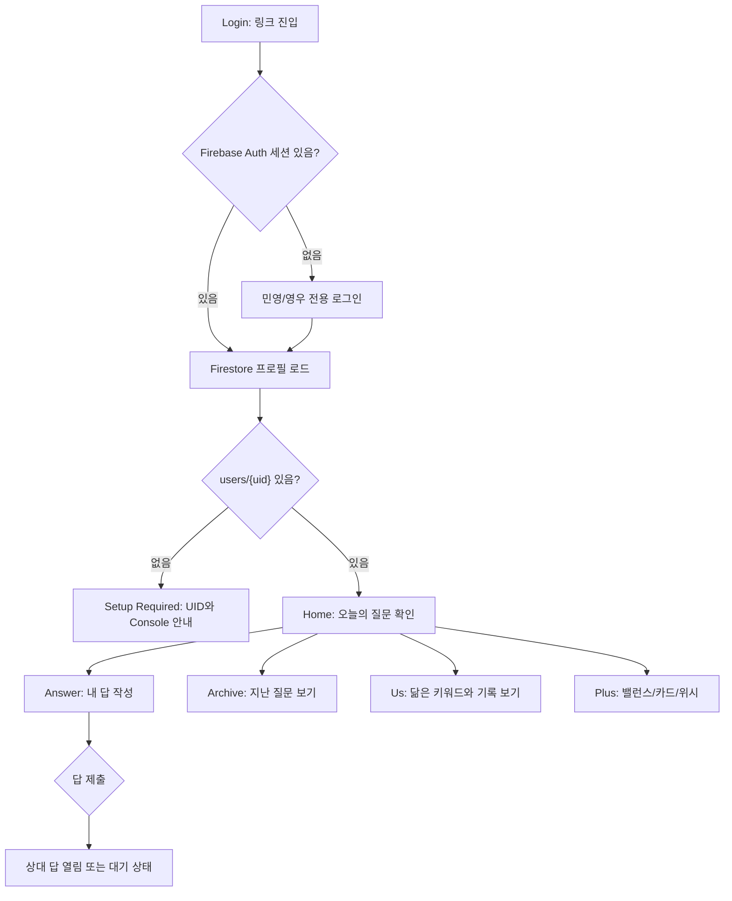
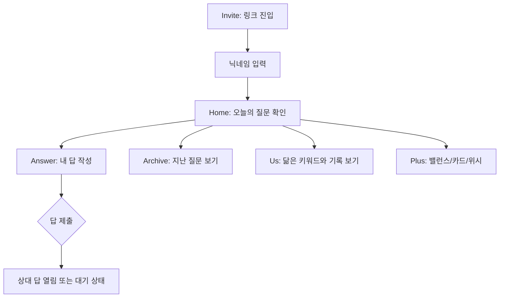

# 알아가기 Product Spec

## 0. Source

- Reference board: `/Users/admin/AndroidStudioProjects/skylife-ux3.0/webapp-design/index.html`
- Primary visual direction: `design2.html` 시안 2, Modern Minimal
- Included flow screens: `invite.html`, `design2.html`, `answer.html`, `archive.html`, `us.html`
- Included plus screens: `balance.html`, `card.html`, `wishlist.html`, `features.html`
- Alternative visual references: `design1.html`, `design3.html`

## 1. Product Summary

`알아가기`는 소개팅 이후 두 사람이 부담 없이 서로를 알아가도록 돕는 비공개 모바일 웹앱이다.
사용자는 링크 하나로 들어오고, 민영과 영우에게만 발급된 아이디/비밀번호로 로그인해 시작한다.
앱은 매일 하나의 질문, 가벼운 밸런스 선택, 천천히 채워지는 소개 카드, 함께 해보고 싶은 위시리스트를 통해 관계가 서두르지 않고 자연스럽게 깊어지도록 설계한다.

현재 Flutter 앱 `민영 Pick`은 `알아가기` 컨셉으로 전체 리디자인한다.
데이트 후보 선택/쿠폰 중심 구조는 제거하거나 후순위로 내리고, 질문 기반의 친밀감 형성 경험을 핵심으로 삼는다.

## 2. Product Goals

- 링크만 열어도 바로 이해되는 둘만의 초대 경험을 만든다.
- 매일 하나의 질문에 답하는 가벼운 루틴을 만든다.
- 내 답을 남기면 상대 답이 열리는 구조로 상호성을 만든다.
- 답하지 않아도 괜찮은 무압박 흐름을 제공한다.
- 쌓인 답변에서 닮은 키워드와 기록을 보여준다.
- “다음 만남”으로 이어질 수 있는 위시리스트를 자연스럽게 제공한다.

## 3. Non Goals

- 공개 소셜 네트워크
- 여러 명이 쓰는 커뮤니티
- 실시간 채팅
- 위치 추적
- 연락 빈도 분석
- 과한 커플앱/기념일앱 톤
- App Store 배포 필수 기능
- 공개 회원가입
- 비밀번호 찾기/이메일 인증 자동화
- 관리자 화면

## 4. Target Users

### Primary User

- 소개팅 이후 호감은 있지만 아직 관계가 확정되지 않은 사람
- 직접적인 고백이나 커플앱보다 가볍고 센스 있는 장치를 선호하는 사람
- 모바일 링크로 부담 없이 들어와 짧게 답할 수 있는 경험을 원하는 사람

### Relationship Stage

- 소개팅 이후 1-4주
- 서로를 더 알고 싶지만 과하게 빠른 친밀감 표현은 피해야 하는 단계
- 앱 표현은 “우리 사귀자”가 아니라 “천천히 알아가 볼래요?”에 머물러야 한다.

## 5. Tone Principles

- 부드럽다: 명령형보다 초대형 문장을 사용한다.
- 조용하다: 과도한 이모지, 알림, 축하 효과를 줄인다.
- 안전하다: 언제든 패스/그만두기 가능하다는 감각을 준다.
- 상호적이다: 한 사람이 일방적으로 관찰하는 느낌을 피한다.
- 천천히 깊어진다: 처음부터 가치관/속마음 질문으로 들어가지 않는다.

### Preferred Copy

- `우리, 천천히 알아가 볼래요?`
- `하루에 질문 하나, 서로의 이야기를 나누는 작고 조용한 공간이에요.`
- `정답은 없어요. 떠오르는 대로, 솔직한 한 줄이면 충분해요.`
- `내 답을 남기면 함께 열려요.`
- `오늘은 답하기 어렵나요? 내일 다시 보기`
- `생각보다 결이 잘 맞는 사이예요`

### Avoided Copy

- `여자친구 앱`
- `커플 전용`
- `사랑 지수`
- `상대 추적`
- `답장 안 했어요`
- `왜 답하지 않았나요?`

## 6. Visual Direction

### Chosen Direction

Reference `design2.html`: Modern Minimal, sage, warm paper, serif title.

### Visual Keywords

- 세이지 미니멀
- 종이 같은 배경
- 낮은 대비의 따뜻함
- serif headline
- 조용한 카드형 정보
- 작은 점 형태의 bottom navigation indicator

### Color Tokens

- Background outer: `#e9e8e2`
- App background: `#f4f3ef`
- Paper: `#fcfcfa`
- Ink: `#2e2e2c`
- Muted: `#9a9890`
- Sage: `#8a9a7e`
- Sage deep: `#6f7f63`
- Lavender accent: `#b9a8c9`
- Line: `#e8e6df`
- Soft sage fill: `#dfe6d4`
- Sage panel: `#cdd6c2`

### Typography

- Display/heading reference: `Nanum Myeongjo`
- Body reference: `Noto Sans KR`
- Flutter implementation should use available fonts first.
- If external font assets are not added in MVP, use system fallback while preserving weight, spacing, and hierarchy.

### Layout

- Mobile first.
- Design target width: 390px.
- Minimum target viewport height: 840px.
- Main content should be constrained around 390-520px on desktop web.
- Cards use 18-24px radius in this specific design system, matching the reference.
- Bottom navigation is fixed at bottom with translucent paper background.
- Avoid nested cards except where the reference explicitly frames a phone preview or a repeated list item.

## 7. Information Architecture

### Primary Navigation

- 홈
- 질문함
- 기록
- 마이

### Expanded Navigation For Plus Features

For MVP, plus features can be reached from home sections or lightweight cards.
If the app grows, bottom navigation may become:

- 홈
- 질문함
- 카드
- 위시

`기록` can remain reachable from 홈/질문함 or be a tab depending on implementation complexity.

## 8. MVP Scope

### MVP v0.2 In Scope

- 초대장 화면
- 닉네임 입력
- 홈 화면
- 오늘의 질문 카드
- 답변 입력/저장
- 내 답 저장 후 상대 답 공개 상태 표현
- 오늘은 패스
- 질문함 목록
- 우리 기록 화면
- 밸런스 게임 1세트
- 소개 카드 화면
- 언젠가 같이 위시리스트 화면
- 로컬 메모리 상태 기반 화면 전환
- Flutter widget/unit tests

### MVP v0.2 Out Of Scope

- 실제 초대 링크 생성
- 실제 다중 사용자 동기화
- 푸시 알림
- 사진 업로드
- 플레이리스트 연동
- 쪽지함
- 타임캡슐 편지
- 실제 로그인/인증
- 데이터 암호화/보안 저장소

### MVP v0.3 Firebase Private In Scope

- Firebase Auth 기반 민영/영우 전용 로그인
- 아이디 입력값을 내부 Firebase 이메일로 매핑
  - `youngwoo` -> `youngwoo@gettoknow.local`
  - `minyoung` -> `minyoung@gettoknow.local`
- Firebase Auth 브라우저 persistence 기반 자동 로그인
- 로그아웃
- 로그인 후 Firestore `users/{uid}` 프로필 문서 로드
- `users/{uid}` 문서가 없으면 UID와 설정 안내를 보여주는 setup required 상태
- Firestore `spaces/{spaceId}` 멤버 공간 모델
- 답변, 패스, 소개 카드 슬롯, 위시 좋아요의 repository 저장 경계
- Firebase dart-define 값이 없을 때 로컬 데모 모드로 빌드/테스트 가능

### MVP v0.3 Firebase Private Out Of Scope

- 앱 안에서 계정 생성
- 비밀번호 변경/초기화 UI
- 소셜 로그인
- 푸시 알림
- 사진 업로드
- 관리자용 데이터 편집 UI
- 완전한 오프라인 충돌 병합

## 9. Core User Flow



### v0.2 Legacy Local Flow



## 10. Screens

### 10.0 Login Screen

Reference: `invite.html`

Purpose:

- Firebase Auth 세션이 없을 때 민영과 영우만 앱에 들어오게 한다.
- 기존 초대장 디자인의 부드러운 분위기를 유지하되, 닉네임 입력 대신 아이디/비밀번호를 받는다.
- 로그인 성공 후에는 Firestore 프로필을 불러와 나와 상대 이름을 정확히 보여준다.

Required UI:

- Status row mock or safe top spacing
- Seal icon area
- Kicker: `A L A G A G I`
- Hero headline: `우리, 천천히 알아가 볼래요?`
- Helper copy: `민영과 영우만 들어올 수 있어요.`
- Login ID field
- Password field
- CTA: `로그인`
- Soft error copy area
- Fine print: `한 번 로그인하면 다음엔 자동으로 이어서 들어와요`

State:

- Signed out
- Signing in
- Invalid id/password error
- Signed in but profile document missing
- Firebase not configured local demo mode

Acceptance Criteria:

- Firebase가 설정된 배포 빌드에서 첫 진입 시 로그인 화면이 보인다.
- `youngwoo` 또는 `minyoung` 아이디는 내부적으로 `@gettoknow.local` 이메일로 매핑된다.
- 로그인 성공 후 `users/{uid}` 문서를 로드하고 홈으로 이동한다.
- 이미 Firebase Auth 세션이 있으면 로그인 화면을 건너뛰고 홈으로 이동한다.
- `users/{uid}` 문서가 없으면 UID와 Firebase Console 설정 안내를 보여준다.
- 로그인 실패 시 입력값을 유지하고 부드러운 오류 문구를 보여준다.
- 비밀번호는 Firestore, app state, local repository에 저장하지 않는다.
- Firebase dart-define 값이 없으면 로컬 데모 모드로 기존 화면을 볼 수 있다.

### 10.1 Invite Screen

Reference: `invite.html`

Purpose:

- 링크를 처음 열었을 때 앱의 분위기와 안전한 사용 방식을 알려준다.
- 가입 없이 닉네임만 입력해 시작하게 한다.

Required UI:

- Status row mock or safe top spacing
- Seal icon area
- Kicker: `A L A G A G I`
- Hero headline: `우리, 천천히 알아가 볼래요?`
- Inviter copy: `{inviterName}님이 당신을 초대했어요.`
- Note rows:
  - 하루에 딱 하나
  - 둘만의 공간
  - 천천히 가까워지기
- Nickname field
- CTA: `우리 공간으로 들어가기`
- Fine print: `가입 절차 없이 바로 시작해요 · 언제든 그만둘 수 있어요`

State:

- Empty nickname
- Prefilled nickname
- Submit disabled or soft validation when nickname is empty
- Submit moves to Home

Acceptance Criteria:

- 첫 진입 시 `우리, 천천히 알아가 볼래요?`가 보인다.
- 닉네임을 입력하고 CTA를 누르면 홈으로 이동한다.
- 닉네임이 비어 있으면 앱은 강하게 막지 않고 부드러운 안내를 보여준다.

### 10.2 Home Screen

Reference: `design2.html`

Purpose:

- 매일 돌아오는 메인 화면.
- 오늘의 질문, 내 답/상대 답 상태, 관계 기록 요약을 한눈에 보여준다.

Required UI:

- Header title: `알아가기`
- Notification dot or icon
- Progress strip:
  - `DAY 12 · 서로의 12번째 질문`
  - `오늘도 한 걸음 가까워졌어요`
  - two avatar markers
- Today question label
- Question card:
  - question number
  - `TODAY'S QUESTION`
  - question text
  - my answer preview
  - partner answer locked/waiting state
  - one-line answer field or CTA
- Insight cards:
  - 마음의 결 percentage
  - 주고받은 질문 count
  - 닮은 취향 키워드
- Bottom navigation

State:

- Not answered today
- My answer saved, partner waiting
- Both answered, partner answer visible
- Today skipped

Acceptance Criteria:

- 홈에 `오늘의 질문`과 질문 번호가 보인다.
- 내 답이 없으면 답변 CTA가 보인다.
- 내 답이 있으면 내 답 preview가 보인다.
- 상대 답이 잠겨 있으면 `내 답을 남기면 함께 열려요` 계열 문구가 보인다.
- 기록 요약으로 닮음 퍼센트, 질문 수, 키워드가 보인다.

### 10.3 Answer Screen

Reference: `answer.html`

Purpose:

- 오늘의 질문에 집중해서 답을 남긴다.
- 답변 후 상대 답을 공개하거나 대기 상태를 보여준다.
- 답변을 강제하지 않고 패스할 수 있게 한다.

Required UI:

- Back button
- Title: `오늘의 질문`
- Day indicator
- Large question number
- Question text
- Answer editor
- Character count, max 300
- Hint card
- Partner answer locked box
- Skip link: `내일 다시 보기`
- Submit CTA: `답 남기고 {partnerName}님 답 열어보기`

State:

- Draft answer
- Character count
- Submitted answer
- Skipped today
- Partner answer locked
- Partner answer revealed

Acceptance Criteria:

- 답변 입력 시 글자 수가 갱신된다.
- 300자를 넘으면 제출을 막거나 초과 상태를 안내한다.
- 제출 후 내 답이 저장된다.
- 상대 답이 준비된 경우 상대 답이 열린다.
- 상대 답이 없는 경우 대기 상태가 유지된다.
- 패스 선택 시 홈으로 돌아가며 오늘 질문은 skipped 상태가 된다.

### 10.4 Archive Screen

Reference: `archive.html`

Purpose:

- 주고받은 질문과 답변을 다시 볼 수 있게 한다.
- 필터로 전체, 둘 다 답함, 닮은 답을 나눠 본다.

Required UI:

- Header: `질문함`
- Subtitle: `그동안 주고받은 {count}개의 이야기`
- Tabs:
  - 전체
  - 둘 다 답함
  - 닮은 답
- QA list items:
  - question number
  - date label
  - status
  - question text
  - my answer
  - partner answer
  - similarity badge when applicable
- Waiting card for current unanswered partner state

State:

- All
- Both answered
- Similar only
- Waiting partner answer
- Empty archive

Acceptance Criteria:

- `전체` 탭은 모든 질문을 보여준다.
- `둘 다 답함` 탭은 양쪽 답이 있는 항목만 보여준다.
- `닮은 답` 탭은 similarity badge가 있는 항목만 보여준다.
- 상대 답 대기 항목은 답변 내용을 보여주지 않고 locked/waiting copy를 보여준다.

### 10.5 Us Record Screen

Reference: `us.html`

Purpose:

- 두 사람의 누적 기록과 닮은 키워드를 보여준다.
- “잘 맞네” 하는 작은 즐거움을 제공한다.

Required UI:

- Header: `우리 기록`
- Subtitle: `{days}일 동안 우리가 닮아온 이야기`
- Hero similarity percentage
- Copy: `생각보다 결이 잘 맞는 사이예요`
- Matched keyword chips
- Stats:
  - 함께한 날
  - 주고받은 질문
  - 닮은 답
  - 가장 긴 답
- Timeline:
  - date
  - event sentence
  - highlighted keyword
- Bottom navigation

Acceptance Criteria:

- 닮음 퍼센트가 홈과 같은 기준으로 표시된다.
- 닮은 키워드가 칩 형태로 보인다.
- 타임라인은 최신순으로 표시된다.
- 기록이 없으면 빈 상태 문구를 보여준다.

### 10.6 Balance Game Screen

Reference: `balance.html`

Purpose:

- 글을 쓰지 않아도 1초 안에 취향을 표현하게 한다.
- 답 안 하는 날을 줄이는 가벼운 장치다.

Required UI:

- Header: `밸런스 게임`
- Progress: `{current} / {total}`
- Question: `둘 중 하나만!`
- Two option cards
- VS marker
- Selected state for me
- Partner choice indicator
- Result summary
- Progress dots
- Next question button

State:

- Before selection
- My selected option
- Partner selected same option
- Partner selected different option
- Next balance question

Acceptance Criteria:

- 선택 전에는 두 선택지가 동일한 가중치로 보인다.
- 하나를 선택하면 선택 상태가 표시된다.
- 상대 선택이 있으면 결과 문장이 표시된다.
- 다음 질문을 누르면 다음 밸런스 질문으로 이동한다.

### 10.7 Profile Card Screen

Reference: `card.html`

Purpose:

- 상대의 정보를 한 번에 묻지 않고 하루 한 칸씩 채워간다.
- 시간이 지나며 상대가 또렷해지는 느낌을 준다.

Required UI:

- Header: `소개 카드`
- Subtitle: `하루 한 칸씩, 서로가 또렷해져요`
- Segmented control:
  - `{partnerName}님 카드`
  - `내 카드`
- Profile card:
  - avatar
  - name
  - days subtitle
  - fill progress
  - slots
- Locked slots
- Today fill card
- Fill input and CTA

State:

- Partner card
- My card
- Filled slot
- Locked slot
- Today fill prompt

Acceptance Criteria:

- 채워진 칸 수와 전체 칸 수가 보인다.
- 잠긴 칸은 내용을 숨기고 열린 날짜/조건을 안내한다.
- 오늘 채울 칸에 답하면 해당 칸이 채워진다.
- 탭 전환 시 상대 카드와 내 카드가 바뀐다.

### 10.8 Wishlist Screen

Reference: `wishlist.html`

Purpose:

- 같이 해보고 싶은 것을 부담 없이 담는다.
- 실제 만남으로 이어질 자연스러운 다리를 만든다.

Required UI:

- Header: `언젠가, 같이`
- Subtitle: `부담 없이 적어두는 우리의 위시리스트`
- Filters:
  - 전체
  - 둘 다
  - 가고 싶은 곳
  - 해보고 싶은 것
- Groups:
  - 둘 다 하고 싶어요
  - 한 명이 담아둔 것
  - 이미 함께했어요
- Wish cards:
  - icon
  - title
  - who added
  - liked/hearted state
  - done state
- Add button: `하고 싶은 것 담기`

State:

- All wishes
- Mutual wishes
- Place wishes
- Activity wishes
- Done wishes
- Add wish draft
- Toggle heart
- Mark as done

Acceptance Criteria:

- 둘 다 선택한 wish는 별도 강조된다.
- 한 명만 담은 wish는 heart action이 가능하다.
- 완료된 wish는 흐리게 처리되고 취소선이 보인다.
- Add CTA는 새 wish draft flow로 이어진다.

## 11. Future Feature Board

Reference: `features.html`

### Priority P1

- 질문 깊이 단계화
- 밸런스 게임
- 소개 카드
- 위시리스트

### Priority P2

- 상대 답 맞춰보기
- 오늘의 기분 한 단어
- 사진 한 장으로 답하기

### Priority P3

- 함께 만드는 플레이리스트
- 한 줄 쪽지함
- 타임캡슐 편지

### Question Depth Ladder

- 1주차: 가벼운 취향
- 2주차: 일상
- 3주차: 생각과 가치관
- 4주차 이후: 속마음

Acceptance Criteria:

- 질문 데이터는 depth level을 가진다.
- 홈은 현재 day/week에 맞는 질문을 보여준다.
- 깊은 질문은 초반 day에는 노출하지 않는다.

## 12. Domain Model Draft

```dart
class AuthUser {
  final String uid;
  final String loginId;
  final String email;
}

class AppProfile {
  final String id;
  final String nickname;
  final String avatar;
  final bool isMe;
}

class DailyQuestion {
  final String id;
  final int day;
  final int number;
  final QuestionDepth depth;
  final String text;
  final String highlightedText;
}

class Answer {
  final String questionId;
  final String profileId;
  final String body;
  final DateTime createdAt;
  final bool skipped;
}

class ArchiveItem {
  final DailyQuestion question;
  final Answer? myAnswer;
  final Answer? partnerAnswer;
  final List<String> matchedKeywords;
}

class RelationshipInsight {
  final int daysTogether;
  final int questionCount;
  final int matchCount;
  final int longestAnswerLength;
  final int similarityPercent;
  final List<String> matchedKeywords;
  final List<TimelineEvent> timeline;
}

class BalanceQuestion {
  final String id;
  final int index;
  final String prompt;
  final BalanceOption left;
  final BalanceOption right;
}

class ProfileSlot {
  final String id;
  final String label;
  final String? value;
  final bool locked;
  final String? unlockHint;
}

class WishItem {
  final String id;
  final String title;
  final WishKind kind;
  final Set<String> likedByProfileIds;
  final bool done;
}

class AlagagiSession {
  final String spaceId;
  final AppProfile me;
  final AppProfile partner;
}
```

## 12.1 Firebase Data Model

### Authentication

- Firebase Auth Email/Password provider를 사용한다.
- 실제 로그인 UI에는 이메일 대신 짧은 아이디를 노출한다.
- UI 아이디는 repository에서만 이메일로 변환한다.
- 자동 로그인은 Firebase Auth의 기본 브라우저 persistence를 사용한다.

### Firestore Collections

`users/{uid}`

```json
{
  "displayName": "민영",
  "avatar": "🪻",
  "role": "guest",
  "spaceId": "main",
  "partnerUid": "{youngwooUid}"
}
```

`spaces/{spaceId}`

```json
{
  "name": "알아가기",
  "memberIds": ["{youngwooUid}", "{minyoungUid}"]
}
```

`spaces/{spaceId}/answers/{questionId_uid}`

```json
{
  "questionId": "q12",
  "profileId": "{uid}",
  "body": "노을 질 때가 좋아요.",
  "createdLabel": "오늘",
  "skipped": false,
  "updatedAt": "serverTimestamp"
}
```

`spaces/{spaceId}/wishes/{wishId}`

```json
{
  "title": "조용한 영화관 가기",
  "kind": "activity",
  "likedByProfileIds": ["{uid}"],
  "done": false,
  "updatedAt": "serverTimestamp"
}
```

### Repository Boundaries

- `AuthRepository` owns sign-in, sign-out, current auth stream, and login-id-to-email mapping.
- `AlagagiDataRepository` owns session/profile load and user-generated writes.
- `AlagagiController` owns screen state and domain transitions, but delegates persistence writes to the repository when present.
- Widget tests use fake repositories; Firebase SDK is not required for ordinary test execution.

## 13. App State Draft

```dart
class AlagagiState {
  final AppProfile me;
  final AppProfile partner;
  final AppRoute route;
  final DailyQuestion todayQuestion;
  final Map<String, Answer> answersByQuestionAndProfile;
  final ArchiveFilter archiveFilter;
  final int activeBalanceIndex;
  final ProfileCardTab profileCardTab;
  final WishlistFilter wishlistFilter;
}
```

## 14. Test Strategy

### Unit Tests

- Login id to Firebase email mapping
- Auth repository success/failure state with fake auth
- Session construction from Firestore-style profile data
- Invite nickname validation
- Daily question selection by day/depth
- Answer submit and skip state
- Partner answer visibility rule
- Archive filtering
- Similarity keyword aggregation
- Balance selection result
- Profile card fill progress
- Wishlist filter and mutual matching

### Widget Tests

- Firebase-enabled app shows login when signed out
- Successful login loads a fake session and enters home
- Existing fake auth session skips login and enters home
- Missing profile document shows setup required state with UID
- Logout returns to login
- Invite shows headline and enters home after nickname submit
- Home shows today question and record summary
- Answer screen updates character count and saves answer
- Archive tabs filter list
- Us record renders stats and timeline
- Balance option selection updates selected state
- Profile card tab switches card content
- Wishlist filter shows mutual wishes

### Visual/Manual Checks

- 390px mobile viewport
- Desktop constrained mobile layout
- Bottom navigation does not cover content
- Long Korean text wraps without overflow
- Disabled/locked states are readable
- No page feels like a public landing page
- Login screen follows `invite.html` visual mood and does not feel like a generic admin form

## 15. Implementation Plan

### Step 1: Spec Lock

- Keep this document as the source of truth.
- Update `docs/sdd.md` to point to this new direction after user approval.

### Step 2: Domain First

- Rename product concepts from `MinyoungPick` to `Alagagi` or `GettingToKnow`.
- Add question, answer, insight, balance, profile card, wishlist models.
- Write unit tests for state transitions before UI refactor.

### Step 3: UI Shell

- Create app theme tokens from section 6.
- Create phone-width responsive shell.
- Add simple local route state.
- Build bottom navigation.

### Step 4: Core Screens

- Invite
- Home
- Answer
- Archive
- Us Record

### Step 5: Plus Screens

- Balance
- Profile Card
- Wishlist

### Step 6: Polish

- Copy pass
- Responsive QA
- Widget test coverage
- `flutter test`
- `flutter analyze`

### Step 7: Firebase Private Login

- Update spec first with auth/session/data model.
- Write fake-auth unit/widget tests before production code.
- Add Firebase config through dart-defines.
- Implement AuthGate, LoginScreen, SetupRequiredScreen.
- Add repository interfaces and Firebase-backed implementations.
- Preserve local demo mode when Firebase config is absent.
- Document Firebase Console setup in `docs/firebase_setup.md`.
- Verify `flutter test`, `flutter analyze`, and release web build.

## 16. Migration Notes From Current App

Current app:

- `민영 Pick`
- date option cards
- random date idea panel
- preference chips
- coupon toggles

New app:

- `알아가기`
- invite and nickname
- daily question and answer
- archive
- relationship record
- balance/profile/wishlist plus features

Migration decision:

- Remove date option selection from the primary MVP.
- Reuse the idea of “위시리스트” as the new home for future date ideas.
- Remove coupon concept from MVP.
- Preserve mobile-first Flutter Web approach.
- Preserve SDD/TDD workflow.

## 17. Open Questions

- 앱 이름을 최종적으로 `알아가기`로 고정할지, `민영 Pick`의 개인화 이름을 일부 남길지.
- 상대 이름을 `민영`으로 고정할지, 닉네임 입력 기반으로 바꿀지.
- 내 이름/상대 이름의 기본값을 무엇으로 둘지.
- MVP에서 실제 local persistence를 넣을지, 메모리 상태로만 갈지.
- Flutter에서 폰트 파일을 번들링할지, 시스템 폰트로 시작할지.
- bottom navigation을 `홈/질문함/기록/마이`로 유지할지, plus features 때문에 `홈/질문함/카드/위시`로 바꿀지.
- Firebase Console에서 두 계정의 최종 비밀번호를 무엇으로 둘지.
